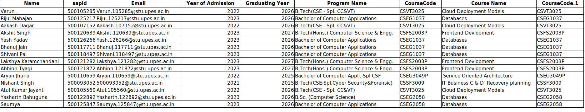

# Instructions for Your Directed Reading Program Course(s)

## Submission Deadline for Final Year Students: 

Your assessments will be conducted on a fast-tracked schedule to meet this deadline October 31st.

## Assessment Schedule for Other Students: 

If your expected graduating year is 2027 or later, you will complete your assessments alongside the regular semester schedule.

## Components:

    1. Assignments: 30 Marks before 25 Oct
    2. Quiz: 20 Marks 25 Oct to 26 Oct
    3. End-Semester Examination (Proctored on CodeTantra): 50 Marks 27th, 28th, and 29th October 2025.

More Updated at [MS Teams Link](https://teams.microsoft.com/l/channel/19%3Anrv9ZewxBG9nU3-D20wORlZOpDobgsgY0wbNovxTho41%40thread.tacv2/General?groupId=4c579368-52bf-4d48-9ac3-088033162576&tenantId=fd8304ce-5079-4bcb-9a54-3240ed7405d9)

https://teams.microsoft.com/l/channel/19%3Anrv9ZewxBG9nU3-D20wORlZOpDobgsgY0wbNovxTho41%40thread.tacv2/General?groupId=4c579368-52bf-4d48-9ac3-088033162576&tenantId=fd8304ce-5079-4bcb-9a54-3240ed7405d9

### List of students/subject assigned to Dr. Prateek Raj Gautam

