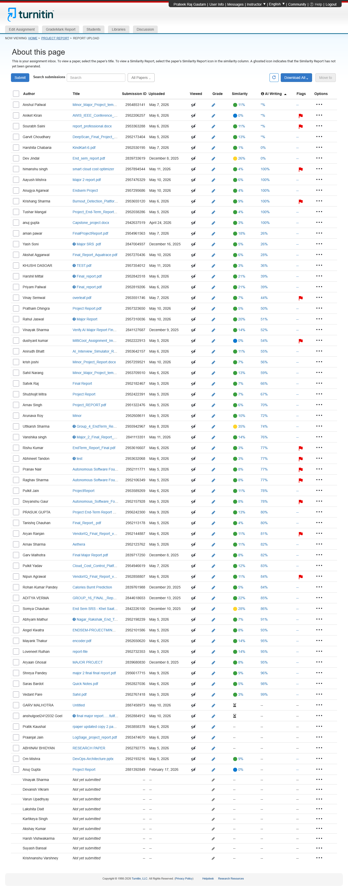



|  First Name   |  Turnitin User ID   |  Title   |  Paper ID   |  Similarity Scor e |
|  :----   |  :----   |  :----   |  :----   |  :---- |
|  Aayush   |  1199346543   |  Major 2 report.pdf   |  2957476329   |   6 |
|  ABHINAV   |  1151897271   |  RESEARCH PAPER   |  2952792775   |  
|  Abhineet   |  1199156944   |  test   |  2953632068   |   3 |
|  Abhyam   |  1199080124   |  Nagar_Rakshak_End_Term_Report.pdf   |  2952198239   |   7 |
|  ADITYA   |  1170581534   |  GROUP_16_FINAL _Report.pdf   |  2844618653   |  2 2 |
|  Akshat   |  1199336179   |  Final_Report_Aquatrace.pdf   |  2957270436   |   6 |
|  aman   |  1199222258   |  FinalProjectReport.pdf   |  2954961563   |  1 8 |
|  Angel   |  1199075159   |  ENDSEM-PROJECTMINOR(Pairr)   |  2952101586   |   8 |
|  Aniket   |  1199080579   |  AWIS_IEEE_Conference_Paper.docx   |  2952206257   |   0 |
|  Anirudh   |  1176567274   |  AI_Interview_Simulator_Report-Final.pdf   |  2953642157   |  1 1 |
|  Anshul   |  1199216736   |  Minor_Major_Project_template_UPES-3.pdf   |  2954853141   |  1 1 |
|  anshulgoel2412032   |  1199108635   |  final major report......fullfinal (1).pdf   |  2952884912   |  
|  Anugya   |  1170194984   |  Endsem Project   |  2957295686   |   4 |
|  Anuj   |  1195157701   |  Project Report   |  2881392849   |   0 |
|  anuj   |  1198545761   |  Capstone_project.docx   |  2942637519   |   3 |
|  Arnav   |  1199044782   |  Project_REPORT.pdf   |  2951322476   |   6 |
|  Arnav   |  1199076613   |  Aethera   |  2952123762   |  1 1 |
|  Arunava   |  1199099399   |  Minor   |  2952608611   |  1 0 |
|  Aryaan   |  1192385611   |  MAJOR PROJECT   |  2839680830   |   8 |
|  Aryan   |  1199075861   |  VendorIQ_Final_Report_v3.docx   |  2952144887   |  1 1 |
|  Dev   |  1192388011   |  End_sem_report.pdf   |  2839733619   |  2 6 |
|  Divyanshu   |  1199078079   |  Autonomous_Software_Foundry.pdf   |  2952157928   |   8 |
|  dushyant   |  1199081312   |  MittiCool_Assignment_Improved_pdf.pdf   |  2952222913   |   0 |
|  Garv   |  1192387264   |  Final Major Report.pdf   |  2839717250   |   8 |
|  GARV   |  1136748295   |  Untitled   |  2887458973   |  
|  Garvit   |  1199078850   |  DeepScan_Final_Project_Report -1.pdf   |  2952173404   |  1 3 |
|  Harshil   |  1172629404   |  Final_report.pdf   |  2952842518   |  2 1 |
|  Harshita   |  1199096110   |  KindKart-6.pdf   |  2952530195   |   1 |
|  himanshu   |  1199364590   |  smart cloud cost optimizer   |  2957894544   |   4 |
|  KHUSHI   |  1136748259   |  TEST.pdf   |  2957354012   |   3 |
|  krish   |  1170999809   |  Minor_Project_Report.docx   |  2957259521   |   7 |
|  Krishang   |  1199158088   |  Burnout_Detection_Platform_Report.docx   |  2953655120   |   9 |
|  Loveneet   |  1199103507   |  report-file   |  2952732353   |  1 4 |
|  Mayank   |  1199075178   |  encoder.pdf   |  2952650620   |  1 4 |
|  Nipun   |  1199107782   |  VendorIQ_Final_Report_v3 (1).docx   |  2952858807   |  1 1 |
|  Om   |  1199079734   |  DevOps-Architecture.pptx   |  2952193216   |   9 |
|  Praanjal   |  1177578388   |  LogSage_project_report.pdf   |  2953474670   |  
|  Pranav   |  1199075157   |  Autonomous Software Foundry.pdf   |  2952111771   |   8 |
|  PRASUK   |  1175928751   |  Project End-Term Report Format.pdf   |  2956242300   |  1 3 |
|  Pratham   |  1199338804   |  Project Report.pdf   |  2957323650   |   5 |
|  Pratik   |  1199168650   |  rpaper updated copy 2.pages   |  2953858378   |  
|  Priyam   |  1199106405   |  Final_report.pdf   |  2952819206   |  2 1 |
|  Pulkit   |  1199154445   |  ProjectReport   |  2953589269   |  1 1 |
|  Pulkit   |  1199221837   |  Cloud_Cost_Control_Platform_Report-2 (1).pdf   |  2954946619   |  1 2 |
|  Raghav   |  1199075411   |  Autonomous Software Foundry.pdf   |  2952106349   |   8 |
|  Rahul   |  1199338204   |  Major Report   |  2957310036   |  2 0 |
|  Rishu   |  1199156029   |  EndTerm_Report_Final.pdf   |  2953616607   |   3 |
|  Rohan   |  1192389160   |  Calories Burnt Prediction   |  2839761988   |   5 |
|  Sahil   |  1199161146   |  Minor_Major_Project_template_UPES-2.pdf   |  2953709510   |  1 3 |
|  Saras   |  1199106488   |  Quick Notes.pdf   |  2952827036   |   5 |
|  Satvik   |  1170976256   |  Final Report   |  2952182467   |   7 |
|  Shreya   |  1199305290   |  major 2 final final report.pdf   |  2956617715   |   9 |
|  Shubhojit   |  1164464973   |  Project Report   |  2952422391   |   7 |
|  Somya   |  1192497557   |  End Sem SRS - Khel Saathi.docx   |  2842226100   |  2 8 |
|  Sourabh   |  1199142461   |  report_professional.docx   |  2953363288   |  1 1 |
|  Tanishq   |  1199076086   |  Final_Report_.pdf   |  2952113178   |   4 |
|  Tushar   |  1171326445   |  Project_End-Term_Report_ (1).pdf   |  2952038286   |   4 |
|  Uttkarsh   |  1199270698   |  Group_4_EndTerm_Report.pdf   |  2955942967   |  3 5 |
|  Vanshika   |  1192389353   |  Major_2_Final_Report_copy.docx   |  2841113351   |  1 4 |
|  Vedant   |  1199104720   |  Sahil.pdf   |  2952767418   |   3 |
|  Vinay   |  1176567214   |  overleaf.pdf   |  2953551746   |   7 |
|  Vinayak   |  1192447445   |  Verify.AI Major Report Final 2 (1).pdf   |  2841127687   |  1 4 |
|  Yash   |  1192719670   |  Major SRS .pdf   |  2847004937   |   5 |
