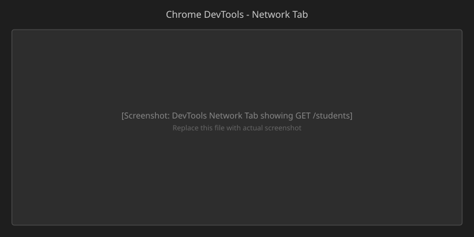

# Lecture 04

# HTTP Requests, DevTools, CURL, Postman, and fetch

**Course Outcome:** CO1 – Understand HTTP fundamentals, inspect request–response cycles, and design RESTful APIs.

---

## Part A – Theory

---

### 1. Introduction

In L03, we studied HTTP fundamentals and built our first backend servers using Express.js and Flask. We saw how a client sends a request and the server returns a response. Today, we go deeper by **inspecting** what actually travels between client and server, and then learn how to **design proper APIs** using REST principles.

By the end of this lecture, you will have:

1. A detailed understanding of HTTP request and response structure.
2. The ability to inspect requests using browser DevTools, curl, and Postman.
3. An understanding of how APIs evolved before REST.
4. Knowledge of REST principles, constraints, and best practices.
5. The ability to build a simple API using FastAPI.

---

### 2. Anatomy of an HTTP Request

Every HTTP request has a precise structure. Understanding this structure is essential for debugging and building APIs.

<svg xmlns="http://www.w3.org/2000/svg" width="900" height="320" viewBox="0 0 900 320">
<rect width="900" height="320" fill="white"/>
<text x="450" y="30" text-anchor="middle" font-size="18" font-weight="bold">HTTP Request Structure</text>
<rect x="40" y="50" width="820" height="60" rx="8" fill="#E0F7FA" stroke="#00ACC1"/>
<text x="60" y="75" font-size="14" font-weight="bold">Request Line</text>
<text x="60" y="95" font-size="13" font-family="monospace">GET /students/5 HTTP/1.1</text>
<rect x="40" y="120" width="820" height="80" rx="8" fill="#EAF4FF" stroke="#1E88E5"/>
<text x="60" y="145" font-size="14" font-weight="bold">Headers</text>
<text x="60" y="165" font-size="12" font-family="monospace">Host: localhost:3000</text>
<text x="60" y="185" font-size="12" font-family="monospace">Accept: application/json</text>
<text x="350" y="165" font-size="12" font-family="monospace">User-Agent: Mozilla/5.0</text>
<text x="350" y="185" font-size="12" font-family="monospace">Content-Type: application/json</text>
<rect x="40" y="210" width="820" height="80" rx="8" fill="#FFF8E6" stroke="#FB8C00"/>
<text x="60" y="235" font-size="14" font-weight="bold">Body (optional)</text>
<text x="60" y="255" font-size="12" font-family="monospace">{ "name": "Aarav", "branch": "CSE" }</text>
<text x="60" y="275" font-size="11" fill="#888">Used with POST, PUT, PATCH methods</text>
<text x="450" y="310" text-anchor="middle" font-size="12" fill="#555">Method + Path + Version | Metadata | Data</text>
</svg>

#### Request Line

The first line of every request contains three parts:

```
METHOD /path HTTP/version
```

| Part | Description | Example |
|------|-------------|---------|
| **Method** | The action the client wants | `GET`, `POST`, `PUT`, `DELETE` |
| **Path** | The resource being requested | `/students`, `/students/1` |
| **Version** | The HTTP version being used | `HTTP/1.1` |

**Example:**

```
GET /students HTTP/1.1
```

#### Request Headers

Headers are key-value pairs that carry metadata about the request.

| Header | Purpose | Example Value |
|--------|---------|---------------|
| **Host** | The server's domain name | `localhost:3000` |
| **User-Agent** | Browser and OS information | `Mozilla/5.0 ...` |
| **Accept** | Data formats the client can handle | `application/json` |
| **Content-Type** | Format of data being sent | `application/json` |
| **Authorization** | Authentication credentials | `Bearer abc123` |

#### Request Body

The body carries data sent to the server. It is optional and typically used with `POST` and `PUT` requests.

```json
{
  "name": "Aarav",
  "branch": "CSE"
}
```

GET requests usually have no body. POST and PUT requests send data in the body.

---

### 3. Anatomy of an HTTP Response

The server's reply follows a similar structure.

<svg xmlns="http://www.w3.org/2000/svg" width="900" height="320" viewBox="0 0 900 320">
<rect width="900" height="320" fill="white"/>
<text x="450" y="30" text-anchor="middle" font-size="18" font-weight="bold">HTTP Response Structure</text>
<rect x="40" y="50" width="820" height="60" rx="8" fill="#E8F8EC" stroke="#43A047"/>
<text x="60" y="75" font-size="14" font-weight="bold">Status Line</text>
<text x="60" y="95" font-size="13" font-family="monospace">HTTP/1.1 200 OK</text>
<rect x="40" y="120" width="820" height="80" rx="8" fill="#EAF4FF" stroke="#1E88E5"/>
<text x="60" y="145" font-size="14" font-weight="bold">Headers</text>
<text x="60" y="165" font-size="12" font-family="monospace">Content-Type: application/json</text>
<text x="60" y="185" font-size="12" font-family="monospace">Content-Length: 256</text>
<text x="400" y="165" font-size="12" font-family="monospace">Cache-Control: no-cache</text>
<text x="400" y="185" font-size="12" font-family="monospace">Set-Cookie: session=abc123</text>
<rect x="40" y="210" width="820" height="80" rx="8" fill="#FFF8E6" stroke="#FB8C00"/>
<text x="60" y="235" font-size="14" font-weight="bold">Body</text>
<text x="60" y="255" font-size="12" font-family="monospace">[{"id":1,"name":"Aarav","branch":"CSE"}]</text>
<text x="60" y="275" font-size="11" fill="#888">JSON, HTML, text, or file data</text>
<text x="450" y="310" text-anchor="middle" font-size="12" fill="#555">Status Code + Metadata | Response Data</text>
</svg>

#### Status Line

```
HTTP/version STATUS_CODE REASON
```

**Example:**

```
HTTP/1.1 200 OK
```

#### Response Headers

| Header | Purpose | Example Value |
|--------|---------|---------------|
| **Content-Type** | Format of the response data | `application/json` |
| **Content-Length** | Size of the response body in bytes | `256` |
| **Cache-Control** | Caching instructions | `no-cache` |
| **Set-Cookie** | Sends a cookie to the client | `session=abc123` |

#### Response Body

The actual data returned by the server — HTML, JSON, a file, or an error message.

```json
[
  { "id": 1, "name": "Aarav", "branch": "CSE" },
  { "id": 2, "name": "Diya", "branch": "ECE" }
]
```

#### Complete HTTP Request–Response Example (Plain Text)

Below is a **raw HTTP request** and its **raw HTTP response** as they travel over the network. This is exactly what tools like DevTools, curl, and Postman show you in a more readable format.

**Raw HTTP Request (sent by the client):**

```text
GET /students HTTP/1.1
Host: localhost:3000
User-Agent: Mozilla/5.0 (Windows NT 10.0; Win64; x64)
Accept: application/json
Connection: keep-alive
```

**Raw HTTP Response (returned by the server):**

```text
HTTP/1.1 200 OK
Content-Type: application/json
Content-Length: 156
Date: Wed, 19 Aug 2026 10:30:00 GMT
Connection: keep-alive

[{"id":1,"name":"Aarav","branch":"CSE"},{"id":2,"name":"Diya","branch":"ECE"},{"id":3,"name":"Rohan","branch":"IT"}]
```

The request starts with the **request line** (`GET /students HTTP/1.1`), 
followed by **headers** (key-value pairs), and 
an empty line marking the end of headers. 

The response follows the same pattern: 
a **status line** (`HTTP/1.1 200 OK`), 
**headers**, 
an empty line, and 
then the **body** (the JSON data).

---

### 4. HTTP Methods Compared

Understanding how each method behaves differently is critical for building APIs.

| Method | Purpose | Has Body? | Typical Response |
|--------|---------|-----------|------------------|
| **GET** | Retrieve data | No | `200 OK` with data |
| **POST** | Create new data | Yes | `201 Created` with new resource |
| **PUT** | Update existing data | Yes | `200 OK` with updated resource |
| **DELETE** | Remove data | No | `204 No Content` |

---

### 5. Inspecting Requests with Browser DevTools

Browser DevTools is the fastest way to see what happens when your browser communicates with a server.

#### How to Open DevTools

- **Windows / Linux:** Press `F12` or `Ctrl + Shift + I`
- **macOS:** Press `Cmd + Option + I`
- Or right-click anywhere on the page and select **Inspect**

#### The Network Tab

1. Open DevTools and click the **Network** tab.
2. Visit a URL (e.g., `http://localhost:3000/students`).
3. A new entry appears in the Network panel.
4. Click on it to see:

| Section | What You See |
|---------|--------------|
| **Headers** | Request method, URL, status code, all headers |
| **Preview** | A formatted view of the response body |
| **Response** | The raw response body |
| **Timing** | How long the request took |

This gives you full visibility into every HTTP exchange between your browser and the server.



---

### 6. Inspecting Requests with curl

**curl** is a command-line tool for sending HTTP requests. It is available on virtually every operating system and is essential for testing APIs without a browser.

#### Basic Syntax

```bash
curl [options] URL
```

#### Common Options

| Option | Purpose | Example |
|--------|---------|---------|
| `-v` | Verbose mode — shows full request/response headers | `curl -v http://localhost:3000/` |
| `-X` | Specify the HTTP method | `curl -X POST http://localhost:3000/students` |
| `-H` | Add a request header | `curl -H "Accept: application/json" ...` |
| `-d` | Send data in the request body | `curl -d '{"name":"Aarav"}' ...` |
| `-i` | Include response headers in output | `curl -i http://localhost:3000/` |

#### Example: Verbose Request

```bash
curl -v http://localhost:3000/students
```

This prints the full request headers, response headers, and response body — everything you need to debug an API.

---

### 7. Inspecting Requests with Postman

**Postman** is a graphical tool designed specifically for building, testing, and debugging APIs. It provides a visual interface for constructing requests and inspecting responses.

#### Key Features

| Feature | Description |
|---------|-------------|
| **Request Builder** | Build requests with a GUI — select method, enter URL, add headers, body |
| **Collections** | Organize and save groups of related requests |
| **Environment Variables** | Switch between development, staging, and production environments |
| **Response Viewer** | View formatted JSON, headers, status codes, and timing |
| **History** | Automatically saves every request you send |

#### Why Use Postman?

- Browser DevTools are great for GET requests but limited for POST, PUT, and DELETE.
- curl is powerful but requires memorizing flags and syntax.
- Postman gives you **visual control** over every part of the request.

---

### 8. Sending Requests with JavaScript `fetch()`

The browser provides a built-in JavaScript API called **`fetch()`** for making HTTP requests directly from client-side code. This is how front-end developers communicate with back-end APIs without needing curl or Postman.

#### Basic Syntax

```javascript
fetch(url, options)
  .then(response => response.json())
  .then(data => console.log(data))
  .catch(error => console.error(error));
```

`fetch()` returns a **Promise** that resolves to a `Response` object. You must call `.json()` (or `.text()`) to extract the body.

#### Example: GET Request — Fetch All Students

```javascript
// Fetch all students from the API
fetch("http://localhost:3000/students")
  .then(response => response.json())
  .then(students => {
    console.log("Students:", students);
    students.forEach(student => {
      console.log(`${student.name} (${student.branch})`);
    });
  })
  .catch(error => console.error("Error:", error));
```

**What happens:**

1. `fetch()` sends `GET /students HTTP/1.1` to the server.
2. The server responds with `200 OK` and a JSON body.
3. `.json()` parses the body into a JavaScript array.
4. The array is logged to the console.

#### Example: GET Request — Fetch a Single Student

```javascript
// Fetch student with ID 1
fetch("http://localhost:3000/students/1")
  .then(response => {
    if (!response.ok) {
      throw new Error(`Student not found: ${response.status}`);
    }
    return response.json();
  })
  .then(student => {
    console.log("Found:", student.name, "-", student.branch);
  })
  .catch(error => console.error("Error:", error));
```

**Note:** `response.ok` is `true` when the status code is 200–299. Always check it to handle errors gracefully.

#### Example: POST Request — Create a New Student

```javascript
// Create a new student using POST
fetch("http://localhost:3000/students", {
  method: "POST",
  headers: {
    "Content-Type": "application/json"
  },
  body: JSON.stringify({
    name: "Priya",
    branch: "CSE"
  })
})
  .then(response => {
    if (!response.ok) {
      throw new Error(`Failed to create: ${response.status}`);
    }
    return response.json();
  })
  .then(newStudent => {
    console.log("Created:", newStudent);
  })
  .catch(error => console.error("Error:", error));
```

**Key points:**

| Part | Purpose |
|------|---------|
| `method: "POST"` | Tells the server this is a create request |
| `headers: { "Content-Type": "application/json" }` | Tells the server the body is JSON |
| `body: JSON.stringify(...)` | Converts a JavaScript object to a JSON string |

#### Example: POST Request using `async/await`

The `async/await` syntax makes asynchronous code easier to read:

```javascript
async function createStudent(name, branch) {
  try {
    const response = await fetch("http://localhost:3000/students", {
      method: "POST",
      headers: { "Content-Type": "application/json" },
      body: JSON.stringify({ name, branch })
    });

    if (!response.ok) {
      throw new Error(`HTTP ${response.status}`);
    }

    const newStudent = await response.json();
    console.log("Created student:", newStudent);
    return newStudent;
  } catch (error) {
    console.error("Failed to create student:", error);
  }
}

// Usage
createStudent("Priya", "CSE");
```

#### Quick Comparison: GET vs POST with `fetch()`

| Aspect | GET | POST |
|--------|-----|------|
| **Purpose** | Read data | Create data |
| **Has body?** | No | Yes |
| **`fetch()` call** | `fetch(url)` | `fetch(url, { method: "POST", headers, body })` |
| **Response** | `200 OK` with data | `201 Created` with new resource |
| **Idempotent?** | Yes | No |

#### Using `fetch()` in an HTML Page

You can use `fetch()` directly in a `<script>` tag:

```html
<!DOCTYPE html>
<html>
<head>
  <title>Student API Client</title>
</head>
<body>
  <h1>Students</h1>
  <ul id="student-list"></ul>

  <script>
    async function loadStudents() {
      const response = await fetch("http://localhost:3000/students");
      const students = await response.json();

      const list = document.getElementById("student-list");
      students.forEach(student => {
        const li = document.createElement("li");
        li.textContent = `${student.name} — ${student.branch}`;
        list.appendChild(li);
      });
    }

    loadStudents();
  </script>
</body>
</html>
```

Open this file in a browser and it will fetch students from your running server and display them as a list.

---

## Part B – Installation

---

### 9. Installing Tools

#### Verify curl (pre-installed)

curl comes pre-installed on most systems.

```bash
curl --version
```

Expected output:

```
curl 8.4.0 (x86_64-pc-linux-gnu) ...
```

If curl is not installed on Windows, it is available by default in Windows 10 and later.

#### Installing Postman

1. Visit [https://www.postman.com/downloads/](https://www.postman.com/downloads/).
2. Download the version for your operating system (Windows, macOS, or Linux).
3. Run the installer and follow the default settings.
4. When Postman opens, you can skip signing in — the basic functionality works without an account.

---

## Part C – Hands-On: HTTP Inspection

---

### 10. Task 1 — Inspect a Request Using Browser DevTools

#### Step 1: Start the Express server

```bash
cd express-demo
node server.js
```

#### Step 2: Open DevTools

1. Open Chrome.
2. Press `F12` to open DevTools.
3. Click the **Network** tab.

#### Step 3: Send a request

In the browser address bar, type:

```
http://localhost:3000/students
```

#### Step 4: Inspect the request

In the Network tab, click on the `students` entry. Observe:

| Field | Expected Value |
|-------|----------------|
| **Request Method** | GET |
| **Status Code** | 200 OK |
| **Request URL** | `http://localhost:3000/students` |
| **Response Content-Type** | `application/json` |

#### Step 5: View the response body

Click the **Response** or **Preview** tab within the entry. You should see:

```json
[
  { "id": 1, "name": "Aarav", "branch": "CSE" },
  { "id": 2, "name": "Diya", "branch": "ECE" },
  { "id": 3, "name": "Rohan", "branch": "IT" }
]
```


---

### 11. Task 2 — Send Requests Using curl

#### Step 1: Simple GET request

Open a new terminal (keep the server running) and type:

```bash
curl http://localhost:3000/students
```

Expected output:

```json
[{"id":1,"name":"Aarav","branch":"CSE"},{"id":2,"name":"Diya","branch":"ECE"},{"id":3,"name":"Rohan","branch":"IT"}]
```

#### Step 2: Verbose mode

```bash
curl -v http://localhost:3000/students
```

This prints the full request and response headers. Look for:

```
> GET /students HTTP/1.1
> Host: localhost:3000
> Accept: */*
```

And the response:

```
< HTTP/1.1 200 OK
< Content-Type: application/json
```

#### Step 3: Request a single student

```bash
curl http://localhost:3000/students/1
```

Expected output:

```json
{"id":1,"name":"Aarav","branch":"CSE"}
```

#### Step 4: Request a non-existent student

```bash
curl http://localhost:3000/students/99
```

Expected output:

```json
{"error": "Student not found"}
```

#### Step 5: Include response headers

```bash
curl -i http://localhost:3000/students
```

This shows both the headers and the body in one output.

---

### 12. Task 3 — Send Requests Using Postman

#### Step 1: Create a new request

1. Open Postman.
2. Click the **+** button to create a new tab.
3. Select **GET** from the method dropdown.
4. Enter the URL: `http://localhost:3000/students`
5. Click **Send**.

#### Step 2: Inspect the response

In the response section, observe:

| Section | What to Look For |
|---------|------------------|
| **Status** | `200 OK` |
| **Body** | The JSON array of students |
| **Headers** | `Content-Type: application/json` |

#### Step 3: Add a request header

1. Click the **Headers** tab in the request section.
2. Add a new header:
   - **Key:** `Accept`
   - **Value:** `application/json`
3. Click **Send** again.

This explicitly tells the server you expect JSON back.

#### Step 4: Send a POST request

1. Change the method to **POST**.
2. Enter the URL: `http://localhost:3000/students`
3. Click the **Body** tab.
4. Select **raw** and choose **JSON** from the dropdown.
5. Enter:

```json
{
  "id": 4,
  "name": "Priya",
  "branch": "CSE"
}
```

6. Click **Send**.

> Note: The server built in L03 does not handle POST requests yet. You may see an error. This is expected — you will add POST handling in L05 when building RESTful APIs.

#### Step 5: Save the request

1. Click the **Save** button (or press `Ctrl + S`).
2. Name it `Get All Students`.
3. Create a collection called `Student Management API`.
4. Click **Save**.

---

### 13. Task 4 — Same Request, Three Tools

#### Request to send:

```
GET http://localhost:3000/students/2
```

#### Using Browser DevTools:

1. Open `http://localhost:3000/students/2` in the browser.
2. Check the Network tab for the request details.

#### Using curl:

```bash
curl -i http://localhost:3000/students/2
```

#### Using Postman:

1. Enter the URL, select GET, click Send.
2. Check the response body and headers.

All three tools send the same HTTP request and receive the same response. The difference is how they **display** the information:

<svg xmlns="http://www.w3.org/2000/svg" width="900" height="280" viewBox="0 0 900 280">
<rect width="900" height="280" fill="white"/>
<text x="450" y="30" text-anchor="middle" font-size="18" font-weight="bold">Three Tools, One Request</text>
<rect x="40" y="50" width="240" height="180" rx="8" fill="#EAF4FF" stroke="#1E88E5"/>
<text x="160" y="80" text-anchor="middle" font-size="16" font-weight="bold">Browser DevTools</text>
<text x="160" y="105" text-anchor="middle" font-size="12">Built into Chrome</text>
<text x="160" y="125" text-anchor="middle" font-size="12">Network Tab</text>
<text x="160" y="145" text-anchor="middle" font-size="12">F12 to open</text>
<rect x="60" y="160" width="200" height="30" rx="4" fill="#1E88E5"/>
<text x="160" y="180" text-anchor="middle" font-size="12" fill="white">Quick browser inspection</text>
<rect x="330" y="50" width="240" height="180" rx="8" fill="#E8F8EC" stroke="#43A047"/>
<text x="450" y="80" text-anchor="middle" font-size="16" font-weight="bold">curl</text>
<text x="450" y="105" text-anchor="middle" font-size="12">Command-line tool</text>
<text x="450" y="125" text-anchor="middle" font-size="12">Pre-installed on OS</text>
<text x="450" y="145" text-anchor="middle" font-size="12">curl -v URL</text>
<rect x="350" y="160" width="200" height="30" rx="4" fill="#43A047"/>
<text x="450" y="180" text-anchor="middle" font-size="12" fill="white">Scripting and automation</text>
<rect x="620" y="50" width="240" height="180" rx="8" fill="#F3E5F5" stroke="#8E24AA"/>
<text x="740" y="80" text-anchor="middle" font-size="16" font-weight="bold">Postman</text>
<text x="740" y="105" text-anchor="middle" font-size="12">GUI application</text>
<text x="740" y="125" text-anchor="middle" font-size="12">Visual request builder</text>
<text x="740" y="145" text-anchor="middle" font-size="12">Save and share requests</text>
<rect x="640" y="160" width="200" height="30" rx="4" fill="#8E24AA"/>
<text x="740" y="180" text-anchor="middle" font-size="12" fill="white">API development workflow</text>
<text x="450" y="260" text-anchor="middle" font-size="14" fill="#555">All send GET http://localhost:3000/students/2 and receive the same JSON response</text>
</svg>

| Tool | Best For |
|------|----------|
| **Browser DevTools** | Quick inspection while browsing |
| **curl** | Scripting, automation, server-side debugging |
| **Postman** | Building, testing, and sharing API requests |

---

### 14. Task 5 — Flask Server Inspection

#### Step 1: Start the Flask server

```bash
cd backend-project
venv\Scripts\activate        # Windows
source venv/bin/activate     # macOS/Linux
python app.py
```

#### Step 2: Use curl

```bash
curl -v http://localhost:5000/students
```

Observe the same request–response structure, now served by Flask on port 5000.

#### Step 3: Use Postman

1. Create a new request in Postman.
2. Enter `http://localhost:5000/students`.
3. Click **Send**.
4. Observe the response — identical in structure to the Express server.

This confirms that HTTP is a **protocol** — the same request works with any server implementation.

---

## Summary

In this lecture, you learned:

* The **structure of an HTTP request** — method, path, version, headers, and body.
* The **structure of an HTTP response** — status code, headers, and body.
* How to use **browser DevTools** to inspect requests in real time.
* How to use **curl** to send requests from the command line.
* How to use **Postman** to build, send, and save API requests.
* How to use JavaScript **`fetch()`** to make HTTP requests from client-side code.

### Key Takeaways

- HTTP requests and responses have a well-defined structure that all servers follow.
- Browser DevTools, curl, and Postman are three essential tools for inspecting HTTP traffic.
- `fetch()` is the browser's built-in API for making HTTP requests from JavaScript.
- All three inspection tools send the same HTTP request — they differ only in how they display the information.
- Understanding raw HTTP structure is essential for debugging APIs effectively.

In **L05 – RESTful APIs and FastAPI**, you will learn REST principles and build a complete CRUD API using FastAPI.

---

### Lab Exercise

1. Start the Express server from L03 and use browser DevTools to capture a screenshot of the request–response cycle for `GET /students`.
2. Use curl to send a GET request to `/students/3` and verify the response matches the expected data.
3. Use Postman to send a GET request to `http://localhost:5000/students` on the Flask server and save it to a new collection.
4. Write a JavaScript `fetch()` function that retrieves all students and filters them by branch `CSE` in the client side.
5. Use `curl -v` to identify all response headers returned by the Express server.
