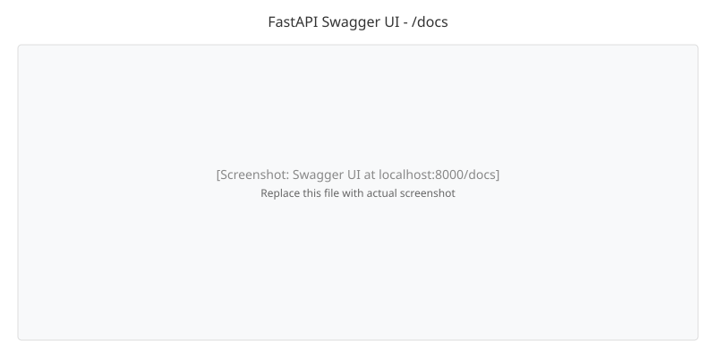
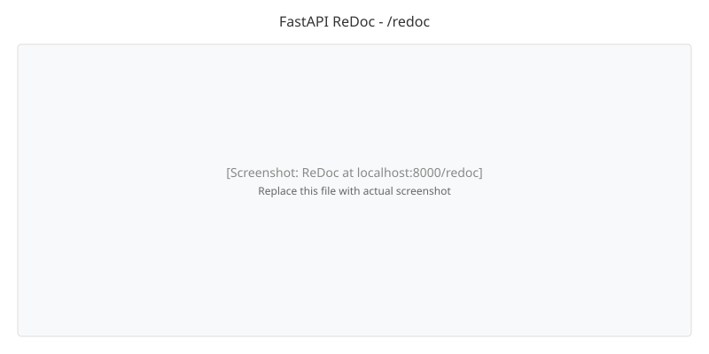

# Lecture 05

# RESTful APIs and FastAPI

**Course Outcome:** CO1 – Understand and design RESTful APIs.

---

### 1. Introduction

In L04, we learned how to inspect HTTP requests and responses using browser DevTools, curl, and Postman. We also learned how to send HTTP requests from JavaScript using `fetch()`. Now, we shift from **observing** HTTP traffic to **designing** proper APIs.

By the end of this lecture, you will have:

1. An understanding of how APIs evolved before REST (SOAP, XML-RPC).
2. Knowledge of REST principles, constraints, and best practices.
3. The ability to design clean, resource-based APIs.
4. The ability to build a complete CRUD API using FastAPI.
5. Familiarity with auto-generated API documentation (Swagger UI and ReDoc).

---

### 2. Before REST: How APIs Worked

Before REST became standard in the early 2000s, web services used different approaches. Understanding these helps appreciate why REST succeeded.

<svg xmlns="http://www.w3.org/2000/svg" width="900" height="200" viewBox="0 0 900 200">
<rect width="900" height="200" fill="white"/>
<text x="450" y="30" text-anchor="middle" font-size="18" font-weight="bold">Evolution of Web APIs</text>
<rect x="40" y="60" width="200" height="100" rx="8" fill="#F3E5F5" stroke="#8E24AA"/>
<text x="140" y="95" text-anchor="middle" font-size="16" font-weight="bold">SOAP</text>
<text x="140" y="115" text-anchor="middle" font-size="12">XML Only</text>
<text x="140" y="135" text-anchor="middle" font-size="12">WSDL Contracts</text>
<rect x="280" y="60" width="200" height="100" rx="8" fill="#E0F7FA" stroke="#00ACC1"/>
<text x="380" y="95" text-anchor="middle" font-size="16" font-weight="bold">XML-RPC</text>
<text x="380" y="115" text-anchor="middle" font-size="12">XML over HTTP</text>
<text x="380" y="135" text-anchor="middle" font-size="12">Simple but Limited</text>
<rect x="520" y="60" width="200" height="100" rx="8" fill="#E8F8EC" stroke="#43A047"/>
<text x="620" y="95" text-anchor="middle" font-size="16" font-weight="bold">REST</text>
<text x="620" y="115" text-anchor="middle" font-size="12">JSON / XML</text>
<text x="620" y="135" text-anchor="middle" font-size="12">Resource-Based</text>
<rect x="760" y="60" width="110" height="100" rx="8" fill="#FFF8E6" stroke="#FB8C00"/>
<text x="815" y="95" text-anchor="middle" font-size="14" font-weight="bold">GraphQL</text>
<text x="815" y="115" text-anchor="middle" font-size="11">Query Language</text>
<text x="815" y="135" text-anchor="middle" font-size="11">2015+</text>
<text x="450" y="190" text-anchor="middle" font-size="12" fill="#555">Complexity Decreased - Developer Adoption Increased</text>
</svg>

#### 2.1 SOAP (Simple Object Access Protocol)

SOAP was the dominant enterprise protocol from the late 1990s to early 2000s.

**Characteristics:**

- Uses XML exclusively for message format
- Requires WSDL (Web Services Description Language) contracts
- Heavy envelope structure with headers and body
- Built-in security (WS-Security) and transactions (WS-AtomicTransaction)
- Used HTTP, SMTP, or other transport protocols

**Example SOAP Request:**

```xml
<?xml version="1.0" encoding="UTF-8"?>
<soap:Envelope xmlns:soap="http://schemas.xmlsoap.org/soap/envelope/">
  <soap:Body>
    <GetStudent xmlns="http://example.com/api">
      <StudentId>1</StudentId>
    </GetStudent>
  </soap:Body>
</soap:Envelope>
```

**Problems:**

- Verbose XML payloads increase bandwidth usage
- Complex tooling required (WSDL parsers, SOAP clients)
- Tight coupling between client and server
- Poor browser support

#### 2.2 XML-RPC

A simpler predecessor to SOAP that also used XML but with less overhead.

**Characteristics:**

- Method calls encoded in XML
- Uses HTTP as transport
- No contract language like WSDL
- Simpler than SOAP but limited features

**Example XML-RPC Request:**

```xml
<?xml version="1.0"?>
<methodCall>
  <methodName>GetStudent</methodName>
  <params>
    <param><value><int>1</int></value></param>
  </params>
</methodCall>
```

#### 2.3 The Problem REST Solved

| Aspect | SOAP | XML-RPC | REST |
|--------|------|---------|------|
| Data Format | XML only | XML only | JSON, XML, HTML |
| Contract | WSDL (complex) | None | Self-documenting |
| Complexity | High | Medium | Low |
| State | Stateful | Stateful | Stateless |
| Browser Support | Poor | Poor | Native |
| Developer Experience | Difficult | Moderate | Simple |

REST solved these problems by using HTTP as-is, supporting JSON, and providing a resource-based mental model.

---

### 3. What is REST?

**REST (Representational State Transfer)** is an architectural style defined by Roy Fielding in his 2000 doctoral dissertation. It is NOT a protocol or standard — it is a set of design constraints.

<svg xmlns="http://www.w3.org/2000/svg" width="800" height="280" viewBox="0 0 800 280">
<rect width="800" height="280" fill="white"/>
<text x="400" y="30" text-anchor="middle" font-size="18" font-weight="bold">REST Core Concepts</text>
<rect x="40" y="60" width="220" height="90" rx="8" fill="#EAF4FF" stroke="#1E88E5"/>
<text x="150" y="90" text-anchor="middle" font-size="14" font-weight="bold">Resources</text>
<text x="150" y="110" text-anchor="middle" font-size="12">Everything is a resource</text>
<text x="150" y="130" text-anchor="middle" font-size="12">Identified by URIs</text>
<rect x="290" y="60" width="220" height="90" rx="8" fill="#E8F8EC" stroke="#43A047"/>
<text x="400" y="90" text-anchor="middle" font-size="14" font-weight="bold">Representations</text>
<text x="400" y="110" text-anchor="middle" font-size="12">JSON, XML, HTML</text>
<text x="400" y="130" text-anchor="middle" font-size="12">Views of resource state</text>
<rect x="540" y="60" width="220" height="90" rx="8" fill="#FFF8E6" stroke="#FB8C00"/>
<text x="650" y="90" text-anchor="middle" font-size="14" font-weight="bold">Stateless</text>
<text x="650" y="110" text-anchor="middle" font-size="12">No server session</text>
<text x="650" y="130" text-anchor="middle" font-size="12">Each request is independent</text>
<rect x="140" y="180" width="520" height="70" rx="8" fill="#FCE4EC" stroke="#E53935"/>
<text x="400" y="210" text-anchor="middle" font-size="14" font-weight="bold">Uniform Interface</text>
<text x="400" y="235" text-anchor="middle" font-size="12">Consistent methods: GET, POST, PUT, DELETE</text>
</svg>

#### 3.1 Key Concepts

**Resources**

- Everything in your API is a **resource** — students, courses, grades, users
- Each resource has a unique identifier (URI)
- Examples: `/students`, `/students/1`, `/courses`

**Representations**

- Resources are not directly transferred — their **representations** are
- A student resource might be represented as JSON, XML, or HTML
- Client specifies preferred representation via `Accept` header

**Stateless**

- The server stores NO session state between requests
- Every request contains all information needed to process it
- Authentication tokens (JWT) replace server-side sessions

#### 3.2 Resource Identification

Every resource is identified by a **URI (Uniform Resource Identifier)**:

| Resource | URI | Description |
|----------|-----|-------------|
| Students collection | `/students` | All students |
| Single student | `/students/1` | Student with ID 1 |
| Student's courses | `/students/1/courses` | Courses for student 1 |
| Courses collection | `/courses` | All courses |

---

### 4. The Six REST Constraints

Roy Fielding defined six constraints that make an API truly RESTful:

<svg xmlns="http://www.w3.org/2000/svg" width="800" height="320" viewBox="0 0 800 320">
<rect width="800" height="320" fill="white"/>
<text x="400" y="30" text-anchor="middle" font-size="18" font-weight="bold">The Six REST Constraints</text>
<rect x="40" y="60" width="220" height="70" rx="8" fill="#EAF4FF" stroke="#1E88E5"/>
<text x="150" y="85" text-anchor="middle" font-size="13" font-weight="bold">Client-Server</text>
<text x="150" y="105" text-anchor="middle" font-size="11">Separation of concerns</text>
<rect x="290" y="60" width="220" height="70" rx="8" fill="#E8F8EC" stroke="#43A047"/>
<text x="400" y="85" text-anchor="middle" font-size="13" font-weight="bold">Stateless</text>
<text x="400" y="105" text-anchor="middle" font-size="11">No session on server</text>
<rect x="540" y="60" width="220" height="70" rx="8" fill="#FFF8E6" stroke="#FB8C00"/>
<text x="650" y="85" text-anchor="middle" font-size="13" font-weight="bold">Cacheable</text>
<text x="650" y="105" text-anchor="middle" font-size="11">Responses declare cacheability</text>
<rect x="40" y="155" width="220" height="70" rx="8" fill="#E0F7FA" stroke="#00ACC1"/>
<text x="150" y="180" text-anchor="middle" font-size="13" font-weight="bold">Uniform Interface</text>
<text x="150" y="200" text-anchor="middle" font-size="11">Consistent resource access</text>
<rect x="290" y="155" width="220" height="70" rx="8" fill="#F3E5F5" stroke="#8E24AA"/>
<text x="400" y="180" text-anchor="middle" font-size="13" font-weight="bold">Layered System</text>
<text x="400" y="200" text-anchor="middle" font-size="11">Client unaware of layers</text>
<rect x="540" y="155" width="220" height="70" rx="8" fill="#FCE4EC" stroke="#E53935"/>
<text x="650" y="180" text-anchor="middle" font-size="13" font-weight="bold">Code on Demand</text>
<text x="650" y="200" text-anchor="middle" font-size="11">Optional executable code</text>
<rect x="140" y="260" width="520" height="40" rx="8" fill="#E0F7FA" stroke="#00ACC1"/>
<text x="400" y="285" text-anchor="middle" font-size="12">First 5 constraints are required; Code on Demand is optional</text>
</svg>

#### 4.1 Client-Server

The client (frontend) and server (backend) are independent. They can evolve separately as long as the interface remains the same.

#### 4.2 Stateless

Each request must contain all information needed. The server does not store session state. This improves scalability and reliability.

#### 4.3 Cacheable

Responses must indicate if they can be cached. This reduces unnecessary server calls and improves performance.

#### 4.4 Uniform Interface

All resources are accessed through the same consistent interface — HTTP methods (GET, POST, PUT, DELETE) on resource URIs.

#### 4.5 Layered System

The client cannot tell if it is connected directly to the server or through intermediaries (load balancers, proxies). This allows flexible deployment.

#### 4.6 Code on Demand (Optional)

The server can send executable code (JavaScript) to extend client functionality. Most REST APIs do not use this constraint.

---

### 5. RESTful Resource Naming Conventions

Proper naming makes APIs intuitive and self-documenting.

<svg xmlns="http://www.w3.org/2000/svg" width="800" height="280" viewBox="0 0 800 280">
<rect width="800" height="280" fill="white"/>
<text x="400" y="30" text-anchor="middle" font-size="18" font-weight="bold">Student Management API - Resource Model</text>
<rect x="250" y="60" width="300" height="50" rx="8" fill="#E8F8EC" stroke="#43A047"/>
<text x="400" y="90" text-anchor="middle" font-size="14" font-weight="bold">/students</text>
<line x1="400" y1="110" x2="200" y2="150" stroke="black" stroke-width="2"/>
<line x1="400" y1="110" x2="400" y2="150" stroke="black" stroke-width="2"/>
<line x1="400" y1="110" x2="600" y2="150" stroke="black" stroke-width="2"/>
<rect x="100" y="150" width="200" height="50" rx="8" fill="#EAF4FF" stroke="#1E88E5"/>
<text x="200" y="180" text-anchor="middle" font-size="12" font-weight="bold">/students/{id}</text>
<rect x="300" y="150" width="200" height="50" rx="8" fill="#FFF8E6" stroke="#FB8C00"/>
<text x="400" y="180" text-anchor="middle" font-size="12" font-weight="bold">/courses</text>
<rect x="500" y="150" width="200" height="50" rx="8" fill="#F3E5F5" stroke="#8E24AA"/>
<text x="600" y="180" text-anchor="middle" font-size="12" font-weight="bold">/users</text>
<text x="400" y="240" text-anchor="middle" font-size="12" fill="#555">Plural nouns for collections, nested for relationships</text>
</svg>

**Rules:**

| Rule | Good | Bad |
|------|------|-----|
| Use plural nouns | `/students` | `/student`, `/getStudents` |
| Use nouns not verbs | `/students` | `/getAllStudents` |
| Use hyphens for multi-word | `/student-profiles` | `/studentProfiles` |
| Nest for relationships | `/students/1/courses` | `/getCoursesByStudent/1` |

---

### 6. HTTP Methods in REST

Each HTTP method maps to a CRUD operation on resources.

<svg xmlns="http://www.w3.org/2000/svg" width="800" height="200" viewBox="0 0 800 200">
<rect width="800" height="200" fill="white"/>
<text x="400" y="30" text-anchor="middle" font-size="18" font-weight="bold">HTTP Methods to CRUD Mapping</text>
<rect x="40" y="60" width="150" height="60" rx="8" fill="#E8F8EC" stroke="#43A047"/>
<text x="115" y="85" text-anchor="middle" font-size="14" font-weight="bold">GET</text>
<text x="115" y="105" text-anchor="middle" font-size="11">Read</text>
<rect x="210" y="60" width="150" height="60" rx="8" fill="#EAF4FF" stroke="#1E88E5"/>
<text x="285" y="85" text-anchor="middle" font-size="14" font-weight="bold">POST</text>
<text x="285" y="105" text-anchor="middle" font-size="11">Create</text>
<rect x="380" y="60" width="150" height="60" rx="8" fill="#FFF8E6" stroke="#FB8C00"/>
<text x="455" y="85" text-anchor="middle" font-size="14" font-weight="bold">PUT</text>
<text x="455" y="105" text-anchor="middle" font-size="11">Update (full)</text>
<rect x="550" y="60" width="150" height="60" rx="8" fill="#F3E5F5" stroke="#8E24AA"/>
<text x="625" y="85" text-anchor="middle" font-size="14" font-weight="bold">DELETE</text>
<text x="625" y="105" text-anchor="middle" font-size="11">Remove</text>
<text x="400" y="160" text-anchor="middle" font-size="12" fill="#555">GET and DELETE are idempotent; POST is not</text>
</svg>

| Method | CRUD | Has Body? | Idempotent? | Typical Response |
|--------|------|-----------|-------------|------------------|
| **GET** | Read | No | Yes | `200 OK` with data |
| **POST** | Create | Yes | No | `201 Created` with new resource |
| **PUT** | Full Update | Yes | Yes | `200 OK` with updated resource |
| **PATCH** | Partial Update | Yes | No | `200 OK` with updated resource |
| **DELETE** | Delete | No | Yes | `204 No Content` |

**Idempotent** means calling the method multiple times produces the same result as calling it once. GET, PUT, and DELETE are idempotent. POST is not — sending the same POST request twice creates two resources.

---

### 7. Status Codes for REST APIs

| Code | Meaning | When to Use |
|------|---------|-------------|
| **200** | OK | Successful GET, PUT, PATCH |
| **201** | Created | Successful POST that creates a resource |
| **204** | No Content | Successful DELETE (no body returned) |
| **400** | Bad Request | Invalid input from client |
| **401** | Unauthorized | Authentication required |
| **403** | Forbidden | Authenticated but not allowed |
| **404** | Not Found | Resource does not exist |
| **409** | Conflict | Duplicate or conflicting state |
| **422** | Unprocessable Entity | Validation errors |
| **500** | Internal Server Error | Unexpected server failure |

---

### 8. REST Best Practices

<svg xmlns="http://www.w3.org/2000/svg" width="800" height="250" viewBox="0 0 800 250">
<rect width="800" height="250" fill="white"/>
<text x="400" y="30" text-anchor="middle" font-size="18" font-weight="bold">REST API Best Practices</text>
<rect x="40" y="60" width="340" height="70" rx="8" fill="#E8F8EC" stroke="#43A047"/>
<text x="210" y="85" text-anchor="middle" font-size="13" font-weight="bold">Use Plural Nouns</text>
<text x="210" y="105" text-anchor="middle" font-size="11">GET /students not /getStudents</text>
<rect x="420" y="60" width="340" height="70" rx="8" fill="#EAF4FF" stroke="#1E88E5"/>
<text x="590" y="85" text-anchor="middle" font-size="13" font-weight="bold">Version Your API</text>
<text x="590" y="105" text-anchor="middle" font-size="11">/api/v1/students</text>
<rect x="40" y="150" width="340" height="70" rx="8" fill="#FFF8E6" stroke="#FB8C00"/>
<text x="210" y="175" text-anchor="middle" font-size="13" font-weight="bold">Use Proper Status Codes</text>
<text x="210" y="195" text-anchor="middle" font-size="11">201 for create, 204 for delete</text>
<rect x="420" y="150" width="340" height="70" rx="8" fill="#F3E5F5" stroke="#8E24AA"/>
<text x="590" y="175" text-anchor="middle" font-size="13" font-weight="bold">Paginate Collections</text>
<text x="590" y="195" text-anchor="middle" font-size="11">?page=1&amp;limit=20</text>
</svg>

1. **Use plural nouns** for resource names (`/students`, not `/student`)
2. **Version your API** (`/api/v1/students`) to support backward compatibility
3. **Use proper status codes** — don't return 200 for errors
4. **Return consistent error responses** with `detail` field
5. **Filter, sort, paginate** collections (`/students?branch=CSE&page=1`)
6. **Use HATEOAS** for discoverability (links in responses)
7. **Document your API** with OpenAPI/Swagger

---

### 9. Introduction to FastAPI

**FastAPI** is a modern Python web framework for building APIs. It is ideal for learning REST because it is simple, fast, and auto-generates API documentation.

**Why FastAPI?**

- **Type hints** with Pydantic for automatic validation
- **Auto-generated docs** at `/docs` (Swagger UI) and `/redoc`
- **Performance** comparable to Node.js and Go
- **Minimal boilerplate** — working API in 10 lines

**Install FastAPI:**

```bash
pip install fastapi uvicorn
```

**Minimal Example:**

```python
from fastapi import FastAPI

app = FastAPI()

@app.get("/")
def read_root():
    return {"message": "Hello, REST!"}
```

Run with: `uvicorn main:app --reload`

Open `http://localhost:8000/docs` to see auto-generated Swagger UI.



Open `http://localhost:8000/redoc` to see auto-generated ReDoc documentation.



#### Running Uvicorn as a Module

Instead of running `uvicorn` from the command line, you can import it in `main.py` and run the server directly:

```python
from fastapi import FastAPI
import uvicorn

app = FastAPI()

@app.get("/")
def read_root():
    return {"message": "Hello, REST!"}


if __name__ == "__main__":
    uvicorn.run("main:app", host="127.0.0.1", port=8000, reload=True)
```

Now run the server with:

```bash
python main.py
```

**What changed:**

- `uvicorn.run()` starts the server programmatically
- `host="127.0.0.1"` — binds to localhost only
- `port=8000` — specifies the port number
- `reload=True` — auto-restarts on code changes (use `False` in production)

This approach is useful when you want to control server settings from within your code rather than the command line.

---

## Part B – Hands-On: Build a RESTful API

---

### 10. Task 1 — Build a RESTful API with FastAPI

Now that you understand HTTP requests and REST principles, let us build a proper RESTful API.

#### Step 1: Create main.py

Create a file called `main.py`:

```python
from fastapi import FastAPI, HTTPException, Query
from pydantic import BaseModel
from typing import Optional, List

app = FastAPI(title="Student Management API", version="1.0.0")


class Student(BaseModel):
    id: int
    name: str
    branch: str


class StudentCreate(BaseModel):
    name: str
    branch: str


students: List[Student] = [
    Student(id=1, name="Aarav", branch="CSE"),
    Student(id=2, name="Diya", branch="ECE"),
    Student(id=3, name="Rohan", branch="IT"),
]

next_id = 4


@app.get("/students", response_model=List[Student])
def list_students(branch: Optional[str] = Query(None)):
    if branch:
        return [s for s in students if s.branch.upper() == branch.upper()]
    return students


@app.get("/students/{student_id}", response_model=Student)
def get_student(student_id: int):
    for student in students:
        if student.id == student_id:
            return student
    raise HTTPException(status_code=404, detail="Student not found")


@app.post("/students", response_model=Student, status_code=201)
def create_student(student: StudentCreate):
    global next_id
    new_student = Student(id=next_id, **student.model_dump())
    students.append(new_student)
    next_id += 1
    return new_student


@app.put("/students/{student_id}", response_model=Student)
def update_student(student_id: int, student: StudentCreate):
    for i, existing in enumerate(students):
        if existing.id == student_id:
            updated = Student(id=student_id, **student.model_dump())
            students[i] = updated
            return updated
    raise HTTPException(status_code=404, detail="Student not found")


@app.delete("/students/{student_id}", status_code=204)
def delete_student(student_id: int):
    for i, student in enumerate(students):
        if student.id == student_id:
            students.pop(i)
            return
    raise HTTPException(status_code=404, detail="Student not found")
```

#### Step 2: Run the server

```bash
uvicorn main:app --reload
```

#### Step 3: Test with Swagger UI

Open `http://localhost:8000/docs` — you will see interactive API documentation.


#### Step 4: Test with curl

**List all students:**

```bash
curl http://localhost:8000/students
```

**Get a single student:**

```bash
curl http://localhost:8000/students/1
```

**Create a student:**

```bash
curl -X POST http://localhost:8000/students \
  -H "Content-Type: application/json" \
  -d '{"name": "Priya", "branch": "CSE"}'
```

**Filter by branch:**

```bash
curl "http://localhost:8000/students?branch=CSE"
```

**Delete a student:**

```bash
curl -X DELETE http://localhost:8000/students/2
```

#### Step 5: Test with Postman

1. Import the endpoints into Postman.
2. Test each CRUD operation.
3. Observe status codes: `200` for GET/PUT, `201` for POST, `204` for DELETE.

---

## Summary

In this lecture, you learned:

* **Before REST**: SOAP used verbose XML with WSDL contracts; XML-RPC was simpler but limited.
* **REST principles**: Resources, Representations, Stateless, Uniform Interface.
* **Six REST constraints**: Client-Server, Stateless, Cacheable, Uniform Interface, Layered System, Code on Demand.
* **Resource naming**: Use plural nouns, nest for relationships, avoid verbs.
* **Status codes**: 200, 201, 204 for success; 400, 401, 403, 404, 422 for client errors.
* **Best practices**: Versioning, filtering, pagination, consistent error responses.
* How to build a **complete CRUD API** using FastAPI with automatic validation and Swagger docs.
* How to use **Swagger UI** (`/docs`) and **ReDoc** (`/redoc`) for API documentation.

### Key Takeaways

- REST is an architectural style, not a protocol — it provides design constraints.
- Proper resource naming (`/students`) is more intuitive than verb-based naming (`/getStudents`).
- FastAPI auto-generates API documentation and validates input using Pydantic models.
- Always use appropriate HTTP status codes to communicate results.
- Swagger UI provides interactive testing; ReDoc provides clean readable documentation.

In **L06 – Managing server-side Session, Cookie, and State Management**, you will learn how servers maintain state across requests.

---

### Lab Exercise

1. Build a FastAPI app that manages a **Course** resource with fields: `id`, `title`, `credits`, `department`.
2. Implement all five CRUD operations (GET all, GET by id, POST, PUT, DELETE).
3. Open Swagger UI at `/docs` and test each endpoint. Capture a screenshot of the Swagger UI.
4. Open ReDoc at `/redoc` and verify the documentation is generated correctly.
5. Add a query parameter `GET /courses?department=CSE` that filters courses by department.
