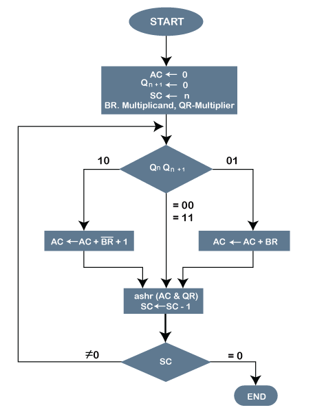
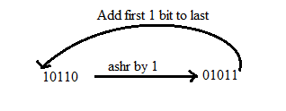

# Booth's Multiplication Algorithm

The booth algorithm is a multiplication algorithm that allows us to multiply the two signed binary integers in 2's complement, respectively. It is also used to speed up the performance of the multiplication process. It is very efficient too. It works on the string bits 0's in the multiplier that requires no additional bit only shift the right-most string bits and a string of 1's in a multiplier bit weight $2^k$ to weight $2^m$ that can be considered as $2^{k+1} - 2^m$.

Following is the pictorial representation of the Booth's Algorithm:

In the above flowchart, initially, **$AC$** and **$Q_{n+1}$** bits are set to 0, and the **$SC$** is a sequence counter that represents the total bits set **n,** which is equal to the number of bits in the multiplier. There are **BR** that represent the **multiplicand bits,** and QR represents the **multiplier bits**. After that, we encountered two bits of the multiplier as $Q_n$ and $Q_{n+1}$, where Qn represents the last bit of QR, and Q_{n + 1 } represents the incremented bit of Qn by 1. Suppose two bits of the multiplier is equal to 10; it means that we have to subtract the multiplier from the partial product in the accumulator $AC$ and then perform the arithmetic shift operation (ashr). If the two of the multipliers equal to 01, it means we need to perform the addition of the multiplicand to the partial product in accumulator $AC$ and then perform the arithmetic shift operation (**ashr**), including **$Q_{n+1}$**. The arithmetic shift operation is used in Booth's algorithm to shift $AC$ and QR bits to the right by one and remains the sign bit in $AC$ unchanged. And the sequence counter is continuously decremented till the computational loop is repeated, equal to the number of bits (n).

### Working on the Booth Algorithm

1.  Set the Multiplicand and Multiplier binary bits as M and Q, respectively.
2.  Initially, we set the $AC$ and $Q_{n+1}$ registers value to 0.
3.  $SC$ represents the number of Multiplier bits (Q), and it is a sequence counter that is continuously decremented till equal to the number of bits (n) or reached to 0.
4.  A Qn represents the last bit of the Q, and the Q_{n+1} shows the incremented bit of Qn by 1.
5.  On each cycle of the booth algorithm, $Q_n$ and $Q_{n+1}$ bits will be checked on the following parameters as follows:
    1.  When two bits $Q_n$ and $Q_{n+1}$ are 00 or 11, we simply perform the arithmetic shift right operation (ashr) to the partial product $AC$. And the bits of Qn and $Q_{n+1}$ is incremented by 1 bit.
    2.  If the bits of $Q_n$ and $Q_{n+1}$ is shows to 01, the multiplicand bits (M) will be added to the $AC$ (Accumulator register). After that, we perform the right shift operation to the $AC$ and QR bits by 1.
    3.  If the bits of $Q_n$ and $Q_{n+1}$ is shows to 10, the multiplicand bits (M) will be subtracted from the $AC$ (Accumulator register). After that, we perform the right shift operation to the $AC$ and QR bits by 1.
6.  The operation continuously works till we reached n - 1 bit in the booth algorithm.
7.  Results of the Multiplication binary bits will be stored in the $AC$ and QR registers.

There are two methods used in Booth's Algorithm:

### 1. RSC (Right Shift Circular)

It shifts the right-most bit of the binary number, and then it is added to the beginning of the binary bits.

### 2. RSA (Right Shift Arithmetic)

It adds the two binary bits and then shift the result to the right by 1-bit position.

**Example**: 0100 + 0110 => 1010, after adding the binary number shift each bit by 1 to the right and put the first bit of resultant to the beginning of the new bit.

**Example: Multiply the two numbers 7 and 3 by using the Booth's multiplication algorithm.**

**Ans**. Here we have two numbers, 7 and 3. First of all, we need to convert 7 and 3 into binary numbers like 7 = (0111) and 3 = (0011). Now set 7 (in binary 0111) as multiplicand (M) and 3 (in binary 0011) as a multiplier (Q). And $SC$ (Sequence Count) represents the number of bits, and here we have 4 bits, so set the $SC$ = 4. Also, it shows the number of iteration cycles of the booth's algorithms and then cycles run $SC$ = $SC$ - 1 time.

| $Q_n$ | $Q_{n+1}$ | M = (0111) M' + 1 = (1001) & Operation | $AC$ | Q | $Q_{n+1}$ | $SC$ |
| --- | --- | --- | --- | --- | --- | --- |
| 1 | 0 | Initial | 0000 | 0011 | 0 | 4 |
|  |  | **Subtract** (M' + 1) | 1001 |  |  |  |
|  |  |  | 1001 |  |  |  |
|  |  | Perform Arithmetic Right Shift operations (ashr) | 1100 | 1001 | 1 | 3 |
| 1 | 1 | Perform Arithmetic Right Shift operations (ashr) | 1110 | 0100 | 1 | 2 |
| **0** | **1** | Addition (A + M) | 0111 |  |  |  |
|  |  |  | 0101 | 0100 |  |  |
|  |  | Perform Arithmetic right shift operation | 0010 | 1010 | 0 | 1 |
| 0 | 0 | Perform Arithmetic right shift operation | **0001** | **0101** | 0 | 0 |

The numerical example of the Booth's Multiplication Algorithm is 7 x 3 = 21 and the binary representation of 21 is 10101. Here, we get the resultant in binary 00010101. Now we convert it into decimal, as $(000010101)_2 = 2*4 + 2*3 + 2*2 + 2*1 + 2*0 => 21$.

**Example: Multiply the two numbers 23 and -9 by using the Booth's multiplication algorithm.**

Here, $M = 23 = (010111) and Q = -9 = (110111)$

| Q_n            $Q_{n+1}$ | $M = 0 1 0 1 1 1  M' + 1 = 1 0 1 0 0 1$ | $$AC$$ | $Q$ | $Q_{n+1}$             $SC$ |
| --- | --- | --- | --- | --- |
|  | Initially | 000000 | 110111 | 0             6 |
| 1             0 | Subtract M | 101001 |  |  |
|  |  | 101001 |  |  |
|  | Perform Arithmetic right shift operation | 110100 | 111011 | 1             5 |
| 1             1 | Perform Arithmetic right shift operation | 111010 | 011101 | 1             4 |
| 1             1 | Perform Arithmetic right shift operation | 111101 | 001110 | 1             3 |
| 0              1 | Addition (A + M) | 010111 |  |  |
|  |  | 010100 |  |  |
|  | Perform Arithmetic right shift operation | 001010 | 000111 | 0             2 |
| 1             0 | Subtract M | 101001 |  |  |
|  |  | 110011 |  |  |
|  | Perform Arithmetic right shift operation | 111001 | 100011 | 1             1 |
| 1             1 | Perform Arithmetic right shift operation | **111100** | **110001** | **1**             0 |

$Q_{n + 1 } \= 1$, it means the output is negative.

Hence, $23 * -9 = 2's$ complement of $111100110001 => (00001100111)$
