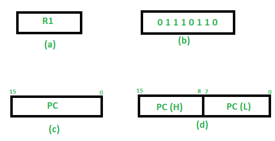
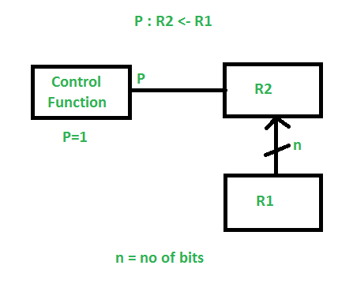
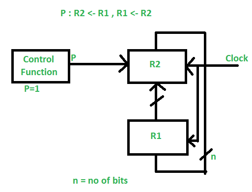

# Introduction to RTL (Register-Transfer Level) Design

RTL (Register-Transfer Level) is a design abstraction used in digital circuit design. It describes the operations and data transfers between registers in a digital system. RTL is a crucial step in the design flow of hardware description languages (HDLs) like Verilog and VHDL.

---

### Key Concepts in RTL Design

1. **Registers**: 
- Registers are storage elements that hold data temporarily.
- Example: A flip-flop is a 1-bit register.

2. **Combinational Logic**:
- Logic circuits that perform operations without memory (e.g., AND, OR, XOR gates).
- Output depends only on the current input.

3. **Sequential Logic**:
- Logic circuits with memory (e.g., flip-flops, registers).
- Output depends on both current input and past states.

4. **Data Path**:
- The path through which data flows between registers and combinational logic.

5. **Control Path**:
- The logic that controls the flow of data in the data path (e.g., state machines).

---

### RTL Design Example

Let's design a simple 4-bit counter in Verilog:

```verilog
module counter (
   input wire clk,       // Clock signal
   input wire reset,     // Reset signal
   output reg [3:0] count // 4-bit counter output
);

always @(posedge clk or posedge reset) begin
   if (reset)            // Reset condition
      count <= 4'b0000; // Reset counter to 0
   else
      count <= count + 1; // Increment counter
end

endmodule
```

- **Explanation**:
- `clk`: Clock signal to synchronize operations.
- `reset`: Resets the counter to 0 when high.
- `count`: A 4-bit register that stores the counter value.
- On every positive edge of the clock (`posedge clk`), the counter increments by 1 unless reset is high.

---

### Steps to Write RTL Code

1. **Define Inputs and Outputs**:
- Identify the inputs (e.g., clock, reset) and outputs (e.g., count).

2. **Declare Registers and Wires**:
- Use `reg` for sequential elements and `wire` for combinational logic.

3. **Write Combinational Logic**:
- Use `assign` statements or `always` blocks for combinational logic.

4. **Write Sequential Logic**:
- Use `always @(posedge clk)` blocks for sequential logic.

5. **Simulate and Verify**:
- Use testbenches to verify the functionality of your RTL design.

---

### Summary of Q&A

1. **What is RTL?**
- RTL (Register-Transfer Level) is a design abstraction that describes data flow between registers and operations in digital circuits.

2. **What are the key components of RTL?**
- Registers, combinational logic, sequential logic, data path, and control path.

3. **How do you write RTL code?**
- Define inputs/outputs, declare registers/wires, write combinational and sequential logic, and simulate the design.

4. **What is an example of RTL design?**
- A 4-bit counter in Verilog that increments on every clock cycle and resets when a reset signal is high.

5. **Why is RTL important?**
- RTL is a critical step in hardware design, bridging high-level design and low-level implementation (e.g., gate-level netlists).

---
# Register Transfer Language (RTL)

In symbolic notation, it is used to describe the micro-operations transfer among registers. It is a kind of intermediate representation (IR) that is very close to assembly language, such as that which is used in a compiler. The term “Register Transfer” can perform micro-operations and transfer the result of operation to the same or other register.

What is Register Transfer Language?
-----------------------------------

Register Transfer Language ([RTL](https://www.geeksforgeeks.org/rtl-register-transfer-level-design-vs-sequential-logic-design/)) is a low-level language that is used to describe the functioning of a digital circuit and, more specifically, the transfer of information between registers. It provides how data moves from one register to the other and how data is processed within the digital system. Through RTL, there is a capability of creating abstraction levels where high-level design descriptions can be created and easily linked to low-level hardware implementation in designing, simulating, as well as synthesizing digital circuits.

Key Concepts of Register Transfer Language(RTL)
-----------------------------------------------

*   The meaningful descriptions are provided by RTL for the flow of data between the registers of the hardware.
*   It is applied to the representation of synchronous circuits: circuits that are controlled by clock signals.
*   Transfer of data and logical operations are described for the register level.
*   As mentioned earlier, RTL designs are documented most often in hardware description languages, including Verilog or VHDL.
*   It is an abstraction layer between high-order Application Specific Integrated Circuits ([ASIC](https://www.geeksforgeeks.org/asic-full-form/)s) and physical devices.

Usage of RTL in Digital Design
------------------------------

*   Proclaims the nature of hardware at the register-transfer level.
*   Formerly utilized to model data flow while using registers.
*   Assists in generation to gate level of designs.
*   It allows simulation and validation of the relevant behaviors of the hardware under design.
*   Serves as the foundation for developing circuits within the digital domain with the use of [HDL](https://www.geeksforgeeks.org/hdl-model-of-combinational-circuits/)s.

#### ****Micro-operations****  

The operation executed on the data store in registers are called micro-operations. They are detailed low-level instructions used in some designs to implement complex machine instructions.

****Register Transfer****

The information transformed from one register to another register is represented in symbolic form by replacement operator is called Register Transfer.

****Replacement Operator****

In the statement, R2 <- R1, ****<-**** acts as a replacement operator. This statement defines the transfer of content of register R1 into register R2.

There are various methods of RTL

1.  General way of representing a register is by the name of the register enclosed in a rectangular box as shown in (a).  
    
2.  Register is numbered in a sequence of 0 to (n-1) as shown in (b).  
    
3.  The numbering of bits in a register can be marked on the top of the box as shown in (c).  
    
4.  A 16-bit register PC is divided into 2 parts- Bits (0 to 7) are assigned with lower byte of 16-bit address and bits (8 to 15) are assigned with higher bytes of 16-bit address as shown in (d).  
    



### ****Basic symbols of RTL****

| Symbol | Description | Example |
| :--- | :--- | :--- |
| Letters and Numbers | Denotes a Register | MAR, R1, R2 |
| `( )` | Denotes a part of register | `R1(8-bit)` `R1(0-7)` |
| <- | Denotes a transfer of information | R2 <- R1 |
| , | Specify two micro-operations of Register Transfer | `R1 <- R2` `R2 <- R1` |
| : | Denotes conditional operations | `P : R2 <- R1` if P=1  |
| Naming Operator (:=) | Denotes another name for an already existing register/alias | Ra := R1 |

#### ****Register Transfer Operations****

The operation performed on the data stored in the registers are referred to as register transfer operations.

There are different types of register transfer operations:

****1. Simple Transfer - R2 <- R1****

The content of R1 are copied into R2 without affecting the content of R1. It is an unconditional type of transfer operation.

****2. Conditional Transfer****



It indicates that if P=1, then the content of R1 is transferred to R2. It is a unidirectional operation.

****3. Simultaneous Operations -****  
If 2 or more operations are to occur simultaneously then they are separated with comma ****(,)****.



If the control function P=1, then load the content of R1 into R2 and at the same clock load the content of R2 into R1.

Advantages of Register Transfer Language (RTL)
----------------------------------------------

*   Enables efficient hardware design.
*   This makes it possible to simulate some activities and perhaps detect some errors at an early date.
*   Implements conceptual description up to the gate-level hardware.
*   It helps to reuse the design components.
*   It gives a clear guide on how to do timing analysis on a given design.

Disadvantages of Register Transfer Language (RTL)
-------------------------------------------------

*   Although the performance is high, this type can be quite challenging to debug.
*   These may lead to inefficient large constructions if not well optimized for beneficial use.
*   The reasoning behind it is rather hardware-oriented and may cause problems that are hard to comprehend without knowledge of message flow.
*   Synthesis results appear to depend on the capabilities of specific tools.
*   Compared to high-level descriptions, the amount of abstraction retrieved by this system is very low.

Conclusion
----------

Register Transfer Language (RTL) is a very important concept in digital design; it provides the methodology of describing and designing hardware. Constricting the representation level of a logic design to the operations on registers and their data movements makes it easier to map the concept on the picture. These benefits include better design for architecture, error detection at an early stage, as well as support for the synthesis process, but there are disadvantages such as being difficult to debug and there could be inefficiency. In summary, RTL acts as a tool of convenience that allows transitioning from the conceptual levels of a design to the physical levels of hardware realization.

FAQs
----

### What is Register Move Language (RTL)?

> RTL is a low-level language used to depict the exchange of information among registers and memory in PC equipment. It assists in characterizing the tasks of a processor and how various parts communicate.

### For what reason is RTL significant in the equipment plan?

> RTL is significant on the grounds that it gives an unmistakable and formal portrayal of information development and tasks inside a processor. This deliberation supports planning, recreating, and checking equipment structures.

### How does RTL vary from machine code?

> RTL is a more elevated-level reflection contrasted with machine code. While machine code addresses the genuine paired directions executed by the processor, RTL portrays the tasks and information moves at a more reasonable level, free of explicit machine guidelines.

### What are the principal parts of RTL?

> The principal parts of RTL incorporate registers, memory, and the tasks that move information between these parts. It likewise characterizes how information is controlled and the way in which various parts collaborate.

### Could RTL at any point be utilized for programming?

> No, RTL isn't commonly utilized for programming. It is basically utilized for equipment planning and reproduction. Programming typically includes more elevated-level dialects like C++, Java, or Python.

### How is RTL utilized in recreation and check?

> RTL is utilized to make equipment models that can be reproduced to confirm that a plan acts true to form. These reenactments help in identifying and fixing issues before genuine equipment is produced.

  
