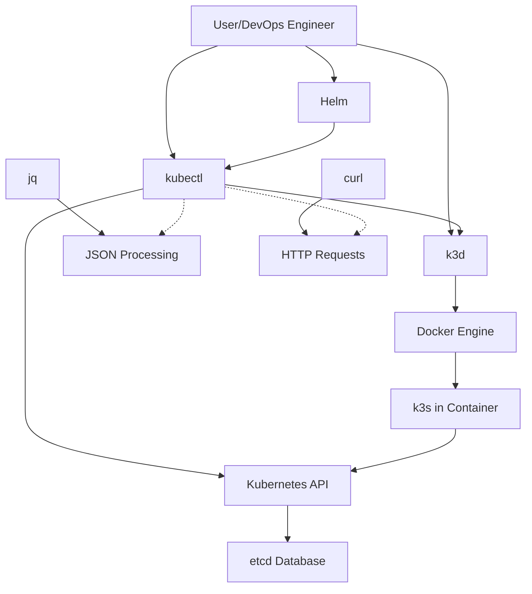

# Tool Dependencies Analysis: Why Each Tool is Needed

## **Architecture Overview**
```
Your Laptop
├── Docker Engine (Container runtime)
├── k3d (k3s orchestrator)
│   └── k3s (Lightweight Kubernetes)
├── kubectl (Kubernetes CLI)
├── Helm (Package manager)
└── Supporting Tools
    ├── jq (JSON processor)
    ├── curl (HTTP client)
    └── wget (Alternative downloader)
```

## **1. Docker Engine - The Foundation**

### **Why Required?**
k3d runs k3s **inside Docker containers**, not as native processes.

### **Use Cases:**
- **Containerization**: k3s components run as Docker containers
- **Isolation**: Each cluster node = separate container
- **Networking**: Docker bridge network for pod networking
- **Storage**: Docker volumes for persistent data

### **Dependencies:**
```bash
# Minimal Docker installation
sudo apt-get update
sudo apt-get install -y docker.io

# Add user to docker group (avoid sudo)
sudo usermod -aG docker $USER
newgrp docker  # Reload group without logout

# Verify
docker version
docker run hello-world
```

**Alternative**: If Docker is too heavy, use `containerd` directly, but configuration complexity increases.

---

## **2. kubectl - The Kubernetes Swiss Army Knife**

### **Why Required?**
- Primary interface to ANY Kubernetes cluster
- Declarative/imperative cluster management
- **Required even if you use k3d CLI**

### **Key Use Cases:**

#### **Cluster Operations**
```bash
# 1. Resource Management
kubectl get pods           # List pods
kubectl describe node      # Node details
kubectl apply -f manifest  # Declarative deployment

# 2. Debugging
kubectl logs -f pod-name   # Stream logs
kubectl exec -it pod -- sh # Interactive shell
kubectl port-forward       # Local access

# 3. Configuration
kubectl config use-context # Switch clusters
kubectl edit deployment    # Live editing
```

#### **Installation Methods:**
```bash
# Method 1: Direct download (recommended)
curl -LO "https://dl.k8s.io/release/$(curl -L -s https://dl.k8s.io/release/stable.txt)/bin/linux/amd64/kubectl"

# Method 2: Package manager (Ubuntu/Debian)
sudo apt-get update && sudo apt-get install -y apt-transport-https ca-certificates curl
curl -fsSL https://packages.cloud.google.com/apt/doc/apt-key.gpg | sudo gpg --dearmor -o /etc/apt/keyrings/kubernetes-archive-keyring.gpg
echo "deb [signed-by=/etc/apt/keyrings/kubernetes-archive-keyring.gpg] https://apt.kubernetes.io/ kubernetes-xenial main" | sudo tee /etc/apt/sources.list.d/kubernetes.list
sudo apt-get update
sudo apt-get install -y kubectl

# Verify
kubectl version --client --output=yaml
```

**Note**: kubectl is **stateless** - no background processes, minimal memory usage.

---

## **3. k3d - The Cluster Orchestrator**

### **Why Required?**
- Wraps k3s in Docker containers
- Manages multi-node clusters easily
- Handles networking between nodes

### **Architecture:**
```
k3d cluster create my-cluster
│
├── Docker Network: k3d-my-cluster
│
├── Container: k3d-my-cluster-server-0 (Control Plane)
│   └── k3s server process
│
└── Container: k3d-my-cluster-agent-0 (Worker)
    └── k3s agent process
```

### **Key Features:**
```bash
# 1. Cluster Lifecycle
k3d cluster create --servers 3 --agents 2
k3d cluster list
k3d cluster start/stop/delete

# 2. Load Balancer
k3d cluster create --port "8080:80@loadbalancer"
# Creates dedicated load balancer container

# 3. Registry Integration
k3d registry create my-registry --port 5000
# Local Docker registry for development

# 4. Configuration
k3d kubeconfig merge   # Manage multiple clusters
```

### **Installation Dependencies:**
```bash
# k3d depends on:
# 1. Docker (already installed)
# 2. bash/zsh (shell for scripts)
# 3. sudo (for system-wide install)

# Install via script
curl -s https://raw.githubusercontent.com/k3d-io/k3d/main/install.sh | bash

# Or download binary directly
wget https://github.com/k3d-io/k3d/releases/download/v5.6.0/k3d-linux-amd64
chmod +x k3d-linux-amd64
sudo mv k3d-linux-amd64 /usr/local/bin/k3d
```

---

## **4. Helm - The Kubernetes Package Manager**

### **Why Required?**
- Install complex applications with single command
- Template management for Kubernetes manifests
- Versioning and release management

### **Use Case Comparison:**

| **Without Helm** | **With Helm** |
|-----------------|---------------|
| `kubectl apply -f deployment.yaml` | `helm install nginx bitnami/nginx` |
| `kubectl apply -f service.yaml` | (Includes deployment, service, configs) |
| `kubectl apply -f configmap.yaml` | |
| **10+ commands** | **1 command** |

### **Common Charts:**
```bash
# 1. Install common tools
helm repo add bitnami https://charts.bitnami.com/bitnami
helm install redis bitnami/redis --set architecture=standalone

helm repo add prometheus-community https://prometheus-community.github.io/helm-charts
helm install prometheus prometheus-community/prometheus

# 2. Create your own charts
helm create myapp
# Generates:
# ├── Chart.yaml          # Metadata
# ├── values.yaml         # Configuration
# ├── templates/          # Kubernetes manifests
# │   ├── deployment.yaml
# │   ├── service.yaml
# │   └── ingress.yaml
# └── charts/             # Sub-charts
```

### **Installation:**
```bash
# Helm has NO external dependencies
curl https://raw.githubusercontent.com/helm/helm/main/scripts/get-helm-3 | bash

# Verify
helm version
helm repo add stable https://charts.helm.sh/stable
helm search repo nginx
```

---

## **5. jq - The JSON Processor**

### **Why Required?**
kubectl and Kubernetes API output JSON. jq parses and transforms it.

### **Critical Use Cases:**

#### **1. Data Extraction**
```bash
# Get just pod names
kubectl get pods -o json | jq -r '.items[].metadata.name'

# Extract container images
kubectl get pods -o json | jq '.items[].spec.containers[].image'

# Filter by label
kubectl get pods -o json | jq '.items[] | select(.metadata.labels.app=="web")'
```

#### **2. Monitoring & Automation**
```bash
# Check pod status
kubectl get pods -o json | jq '[.items[] | {name: .metadata.name, status: .status.phase}]'

# Resource usage summary
kubectl get pods -o json | jq '
  .items[] | 
  {name: .metadata.name, 
   cpu: .spec.containers[].resources.requests.cpu // "none",
   memory: .spec.containers[].resources.requests.memory // "none"}
'

# Find problematic pods
kubectl get pods -o json | jq '.items[] | select(.status.phase != "Running")'
```

#### **3. Configuration Generation**
```bash
# Create ConfigMap from JSON
echo '{"DB_HOST":"localhost","DB_PORT":"5432"}' | jq -r 'to_entries[] | "\(.key)=\(.value)"' | kubectl create configmap app-config --from-env-file=/dev/stdin
```

### **Installation:**
```bash
# Ubuntu/Debian
sudo apt-get install -y jq

# CentOS/RHEL
sudo yum install -y jq

# macOS
brew install jq

# Verify
echo '{"test": "value"}' | jq '.test'
```

---

## **6. curl/wget - HTTP Clients**

### **Why Required?**
- Download binaries (kubectl, helm, k3d)
- Test Kubernetes API endpoints
- Health checks

### **Use Cases:**
```bash
# 1. Download tools
curl -LO https://storage.googleapis.com/kubernetes-release/release/v1.27.0/bin/linux/amd64/kubectl

# 2. Test API server
curl -k https://localhost:6443/api/v1/namespaces
# With authentication
curl -k -H "Authorization: Bearer $(kubectl get secret -n kube-system -o jsonpath='{.data.token}' | base64 --decode)" https://localhost:6443/api/v1/pods

# 3. Health checks
curl http://pod-ip:pod-port/health
```

### **Installation:**
```bash
# Usually pre-installed, but if not:
sudo apt-get install -y curl wget
```

---

## **Tool Interaction Diagram**



## **Installation Script (Complete)**

```bash
#!/bin/bash
# install-k8s-tools.sh
set -e  # Exit on error

echo "=== Kubernetes Learning Environment Setup ==="

# Update system
sudo apt-get update

# 1. Install Docker
echo "Installing Docker..."
sudo apt-get install -y docker.io
sudo usermod -aG docker $USER

# 2. Install HTTP tools
echo "Installing curl and wget..."
sudo apt-get install -y curl wget

# 3. Install jq
echo "Installing jq..."
sudo apt-get install -y jq

# 4. Install kubectl
echo "Installing kubectl..."
curl -LO "https://dl.k8s.io/release/$(curl -L -s https://dl.k8s.io/release/stable.txt)/bin/linux/amd64/kubectl"
chmod +x kubectl
sudo mv kubectl /usr/local/bin/

# 5. Install k3d
echo "Installing k3d..."
curl -s https://raw.githubusercontent.com/k3d-io/k3d/main/install.sh | bash

# 6. Install Helm
echo "Installing Helm..."
curl https://raw.githubusercontent.com/helm/helm/main/scripts/get-helm-3 | bash

# 7. Verify installations
echo "=== Verification ==="
docker --version
kubectl version --client --short
k3d version
helm version
jq --version

echo "=== Setup Complete ==="
echo "1. Log out and log back in for Docker group permissions"
echo "2. Test with: docker run hello-world"
echo "3. Create cluster: k3d cluster create dev"
```

## **Minimal vs Full Installation**

### **Minimal (4GB RAM systems):**
```bash
# Absolutely essential only
sudo apt-get install docker.io kubectl k3d

# Skip: Helm, jq (install on-demand)
# Use kubectl's built-in JSONPath instead of jq:
kubectl get pods -o=jsonpath='{range .items[*]}{.metadata.name}{"\n"}{end}'
```

### **Full (Recommended for learning):**
```bash
# Everything mentioned
# Tools will use:
# - RAM: < 50MB (idle)
# - Disk: ~200MB
# - CPU: Minimal
```

## **Tool Alternatives**

| **Tool** | **Alternative** | **When to Use** |
|----------|----------------|-----------------|
| jq | `yq` (YAML processor) | Working with YAML manifests |
| curl | `httpie`, `wget` | Personal preference |
| Helm | `kustomize` | Simpler customization needs |
| k3d | `kind`, `minikube` | Different learning focus |

## **Dependency Chain**

```
┌─────────────────────────────────────────────┐
│           Your Application                   │
├─────────────────────────────────────────────┤
│  Helm Charts / kubectl apply                │
├─────────────────────────────────────────────┤
│  kubectl CLI                                │
├─────────────────────────────────────────────┤
│  k3d cluster                                │
├─────────────────────────────────────────────┤
│  Docker Containers (k3s nodes)              │
├─────────────────────────────────────────────┤
│  Docker Engine                              │
└─────────────────────────────────────────────┘
Supporting: jq (parsing), curl (downloads)
```

## **Practical Example: Complete Workflow**

```bash
# 1. Install tools (one-time)
./install-k8s-tools.sh

# 2. Create cluster
k3d cluster create learn --servers 1 --agents 2

# 3. Deploy application with Helm
helm repo add bitnami https://charts.bitnami.com/bitnami
helm install wordpress bitnami/wordpress

# 4. Monitor using jq
watch -n 2 'kubectl get pods -o json | jq ".items[] | {name:.metadata.name, status:.status.phase}"'

# 5. Test connectivity
curl -s http://wordpress.local | grep -o "<title>.*</title>"

# 6. Clean up
helm uninstall wordpress
k3d cluster delete learn
```

## **Memory Footprint (Approximate)**

| **Tool** | **Idle RAM** | **Active RAM** |
|----------|--------------|----------------|
| Docker daemon | 50-100MB | 200MB+ |
| k3d (CLI only) | 0MB | 10MB |
| kubectl | 0MB | 5-10MB |
| Helm | 0MB | 5MB |
| jq | 0MB | <1MB |
| **Total** | **50-100MB** | **~250MB** |

**Note**: Cluster containers (k3s nodes) add 300-500MB each when running.

## **Conclusion**

Each tool serves a specific purpose in the Kubernetes ecosystem:

1. **Docker** - Foundation runtime
2. **k3d** - Cluster management abstraction
3. **kubectl** - Universal Kubernetes interface
4. **Helm** - Application packaging
5. **jq** - Data processing glue
6. **curl/wget** - Infrastructure utilities

This toolchain represents the **minimum viable professional toolkit** for Kubernetes development and learning. Each tool can be learned incrementally as you progress through your Kubernetes journey.


---

# Kubernetes Journey: Docker Expert → k3d/k3s Pro

## Tool Selection Rationale

**Why k3d over others for a Docker expert:**
- Uses Docker as runtime (familiar)
- Minimal abstraction layer
- 60-second cluster creation
- 1GB RAM per cluster typical
- Pure container orchestration learning

---
## Installation & Setup

### 1. System Preparation
```bash
# Clean Docker state (optional)
docker system prune -a --volumes

# Install essential tools
sudo apt update && sudo apt install -y curl jq
```

### 2. Install k3d (Latest Version)
```bash
# Method 1: Direct install
wget -q -O - https://raw.githubusercontent.com/k3d-io/k3d/main/install.sh | bash

# Method 2: Via package manager (Linux)
curl -s https://raw.githubusercontent.com/k3d-io/k3d/main/install.sh | TAG=v5.6.0 bash

# Verify installation
k3d version
```

### 3. Install kubectl
```bash
# Download latest stable
curl -LO "https://dl.k8s.io/release/$(curl -L -s https://dl.k8s.io/release/stable.txt)/bin/linux/amd64/kubectl"

# Install
sudo install -o root -g root -m 0755 kubectl /usr/local/bin/kubectl

# Verify
kubectl version --client --output=yaml
```

### 4. Install Helm (Package Manager)
```bash
curl https://raw.githubusercontent.com/helm/helm/main/scripts/get-helm-3 | bash
```

---
## Cluster Creation Strategies

### Basic Single-Node Cluster
```bash
# Minimal cluster (traefik disabled for less resource usage)
k3d cluster create mycluster \
  --servers 1 \
  --agents 0 \
  --k3s-arg "--disable=traefik@server:0" \
  --k3s-arg "--disable=metrics-server@server:0" \
  --port "8080:80@loadbalancer" \
  --port "8443:443@loadbalancer"
```

---
### Multi-Node Learning Cluster
```bash
# 2 workers for learning scheduling
k3d cluster create learn-cluster \
  --servers 1 \
  --agents 2 \
  --k3s-arg "--disable=traefik@server:0" \
  --k3s-arg "--disable=servicelb@server:0" \
  --registry-create registry.local:0.0.0.0:5000 \
  --image rancher/k3s:v1.27.4-k3s1  # Pin version for consistency
```

---
### Ultra-Low Resource Cluster
```bash
# For 4GB RAM systems
k3d cluster create lowspec \
  --servers 1 \
  --agents 0 \
  --k3s-arg "--disable=traefik@server:0" \
  --k3s-arg "--disable=metrics-server@server:0" \
  --k3s-arg "--disable=servicelb@server:0" \
  --k3s-arg "--disable=local-storage@server:0" \
  --k3s-arg "--disable=coredns@server:0"
```

---
## Cluster Management Commands

```bash
# List clusters
k3d cluster list

# Get cluster info
k3d cluster get mycluster

# Access kubeconfig
k3d kubeconfig merge mycluster -d ~/.k3d/kubeconfig-mycluster.yaml
export KUBECONFIG=~/.k3d/kubeconfig-mycluster.yaml

# Stop/Start cluster (save resources)
k3d cluster stop mycluster
k3d cluster start mycluster

# Delete cluster
k3d cluster delete mycluster
```

---
## Core Learning Path with Commands
---
### Phase 1: Foundation (Week 1)

#### 1.1 Pod Operations
```bash
# Imperative pod creation
kubectl run nginx --image=nginx:alpine --restart=Never

# Watch pod lifecycle
kubectl get pods -w

# Interactive pod for debugging
kubectl run debug --image=busybox:latest -it --rm --restart=Never -- sh

# Pod details (Docker container equivalent)
kubectl describe pod nginx
```

#### 1.2 YAML Basics
```bash
# Generate YAML template
kubectl run nginx --image=nginx:alpine --dry-run=client -o yaml > pod.yaml

# Apply YAML
kubectl apply -f pod.yaml

# Edit live object
kubectl edit pod nginx

# Diff changes
kubectl diff -f pod.yaml
```
---
### Phase 2: Controllers (Week 2)

#### 2.1 Deployments
```bash
# Create deployment
kubectl create deployment web --image=nginx:alpine --replicas=3

# Rollout management
kubectl rollout status deployment/web
kubectl rollout history deployment/web
kubectl rollout undo deployment/web

# Scale deployment
kubectl scale deployment web --replicas=5

# Autoscale (if metrics-server installed)
kubectl autoscale deployment web --min=2 --max=5 --cpu-percent=80
```

#### 2.2 Services
```bash
# Expose deployment
kubectl expose deployment web --port=80 --target-port=80 --type=ClusterIP

# Create NodePort for external access
kubectl expose deployment web --port=80 --type=NodePort

# DNS resolution test
kubectl run test --image=busybox -it --rm --restart=Never -- \
  sh -c "nslookup web.default.svc.cluster.local"

# Port forwarding
kubectl port-forward svc/web 8080:80 &
```
---
### Phase 3: Configuration & Storage (Week 3)

#### 3.1 ConfigMaps & Secrets
```bash
# Create from literal
kubectl create configmap app-config \
  --from-literal=DB_HOST=postgres \
  --from-literal=LOG_LEVEL=debug

# Create from file
kubectl create configmap nginx-config --from-file=nginx.conf

# Create secret
kubectl create secret generic db-secret \
  --from-literal=password=s3cret \
  --from-literal=username=admin

# Encode secret manually
echo -n 'password' | base64
```

#### 3.2 Volumes
```bash
# Local volume (hostPath - for learning only)
cat <<EOF | kubectl apply -f -
apiVersion: v1
kind: Pod
metadata:
  name: test-pv
spec:
  containers:
  - name: test
    image: nginx
    volumeMounts:
    - name: data
      mountPath: /data
  volumes:
  - name: data
    hostPath:
      path: /tmp/k8s-data
      type: DirectoryOrCreate
EOF
```

### Phase 4: Advanced Patterns (Week 4)

#### 4.1 Jobs & CronJobs
```bash
# One-time job
kubectl create job hello --image=busybox -- /bin/sh -c "echo Hello"

# CronJob
kubectl create cronjob hello --image=busybox --schedule="*/1 * * * *" -- /bin/sh -c "date"
```

#### 4.2 Probes
```yaml
# Liveness probe example
livenessProbe:
  httpGet:
    path: /health
    port: 8080
  initialDelaySeconds: 30
  periodSeconds: 10

# Startup probe (for slow-starting apps)
startupProbe:
  httpGet:
    path: /ready
    port: 8080
  failureThreshold: 30
  periodSeconds: 5
```

---
## Resource Optimization for Low-Spec

### 1. Node Resource Allocation
```bash
# Check cluster resource usage
kubectl top nodes
kubectl top pods -A

# Create resource quota
cat <<EOF | kubectl apply -f -
apiVersion: v1
kind: ResourceQuota
metadata:
  name: low-resource-quota
spec:
  hard:
    requests.cpu: "1"
    requests.memory: 1Gi
    limits.cpu: "2"
    limits.memory: 2Gi
EOF
```

### 2. Pod Resource Limits
```yaml
# Always set limits in development
resources:
  requests:
    memory: "64Mi"
    cpu: "50m"
  limits:
    memory: "128Mi"
    cpu: "100m"
```

### 3. Cleanup Script
```bash
#!/bin/bash
# cleanup.sh - Daily cluster maintenance
echo "Cleaning up terminated pods..."
kubectl delete pods --field-selector=status.phase==Succeeded

echo "Deleting failed pods..."
kubectl delete pods --field-selector=status.phase==Failed

echo "Clearing completed jobs..."
kubectl delete jobs --field-selector=status.successful==1

echo "Pruning unused resources..."
kubectl get deployments --no-headers | awk '{print $1}' | xargs -I {} kubectl scale deployment {} --replicas=0
```

---
## Troubleshooting Commands

```bash
# Common issues and solutions

# 1. Pod stuck in Pending
kubectl describe pod <pod-name> | grep -A 10 Events
kubectl get events --sort-by='.lastTimestamp'

# 2. Image pull issues
kubectl describe pod <pod-name> | grep -i image
docker pull <image-name>  # Test locally

# 3. DNS problems
kubectl run dns-test --image=busybox -it --rm --restart=Never -- \
  nslookup kubernetes.default

# 4. Resource issues
kubectl describe nodes | grep -A 10 -B 5 "Allocated resources"

# 5. Network connectivity
kubectl run net-test --image=alpine -it --rm --restart=Never -- \
  sh -c "ping -c 3 <service-name>"
```

---
## Development Workflow

### 1. Local Registry Setup
```bash
# Create registry
k3d registry create registry.local --port 5000

# Build and push image
docker build -t registry.local:5000/myapp:v1 .
docker push registry.local:5000/myapp:v1

# Use in deployment
kubectl create deployment myapp --image=registry.local:5000/myapp:v1
```

### 2. Hot Reload Development
```bash
# Use Skaffold for development
curl -Lo skaffold https://storage.googleapis.com/skaffold/releases/latest/skaffold-linux-amd64
chmod +x skaffold
sudo mv skaffold /usr/local/bin/

# skaffold.yaml
cat <<EOF > skaffold.yaml
apiVersion: skaffold/v2beta29
kind: Config
build:
  artifacts:
  - image: registry.local:5000/myapp
    docker:
      dockerfile: Dockerfile
deploy:
  kubectl:
    manifests:
    - k8s/*.yaml
EOF
```

---
## Performance Monitoring

```bash
# Install metrics-server (if needed)
kubectl apply -f https://github.com/kubernetes-sigs/metrics-server/releases/latest/download/components.yaml

# Monitor in real-time
watch -n 2 'kubectl top pods && echo "---" && kubectl top nodes'

# Resource dashboard (optional - uses more resources)
helm repo add kubernetes-dashboard https://kubernetes.github.io/dashboard/
helm install dashboard kubernetes-dashboard/kubernetes-dashboard
```

---
## Daily Practice Routine

### Morning (15 mins)
```bash
# 1. Fresh cluster
k3d cluster delete practice-cluster --yes
k3d cluster create practice-cluster --servers 1 --agents 1

# 2. Deploy test app
kubectl create deployment test --image=nginx
kubectl expose deployment test --port=80

# 3. Break something
kubectl delete pod -l app=test
```

### Evening (10 mins)
```bash
# 1. Cleanup
k3d cluster delete practice-cluster --yes

# 2. Review
kubectl config get-contexts
k3d cluster list

# 3. Plan next day's topic
```

## Learning Resources

### Quick Reference
```bash
# Cheat sheet
kubectl explain <resource>  # API documentation
kubectl api-resources       # List all resources
kubectl api-versions        # API versions available
```

---
### Essential Commands Summary
```bash
# Cluster info
kubectl cluster-info
kubectl version

# Get resources
kubectl get all -A
kubectl get <resource> --show-labels
kubectl get <resource> -o wide
kubectl get <resource> -o yaml

# Debug
kubectl logs -f <pod>
kubectl exec -it <pod> -- <command>
kubectl attach <pod> -c <container>

# Modify
kubectl label <resource> <name> key=value
kubectl annotate <resource> <name> key=value
kubectl patch <resource> <name> -p '{"spec": {...}}'
```

---
## Graduation Exercise

After 4 weeks, test yourself:

```bash
# Create cluster
k3d cluster create exam --servers 1 --agents 2

# Deploy 3-tier app
# 1. PostgreSQL with PersistentVolume
# 2. Redis with ConfigMap
# 3. Go/Node.js app with:
#    - Liveness/Readiness probes
#    - Resource limits
#    - Environment variables
#    - Service (ClusterIP)
#    - Ingress
# 4. CronJob for backups
# 5. HorizontalPodAutoscaler

# Clean up
k3d cluster delete exam
```

**Success Criteria:**

- All pods running
- Services accessible
- No resource warnings
- Clean delete/recreate cycle < 5 minutes

---

## Final Notes

1. **Think in YAML**: Everything in Kubernetes is declarative
2. **Embrace Impermanence**: Pods are cattle, not pets
3. **Learn to Debug**: 80% of Kubernetes is troubleshooting
4. **Start Simple**: Master Pod → Deployment → Service before advanced topics
5. **Practice Daily**: 15 minutes daily > 4 hours weekly

Your Docker expertise gives you a massive advantage. Kubernetes is just Docker orchestration at scale. Focus on the orchestration patterns, not the container runtime.

**Next Steps After Mastery:**

1. Helm charts
2. GitOps (Flux/ArgoCD)
3. Custom Resource Definitions
4. Operators
5. Service Meshes (Istio/Linkerd)

Remember: k3d is for learning. For production-like environments, migrate to k3s directly or consider managed Kubernetes (EKS/GKE/AKS) when ready.