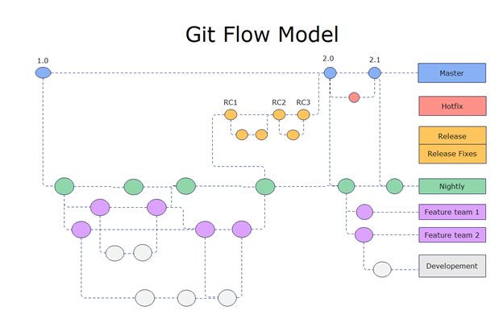
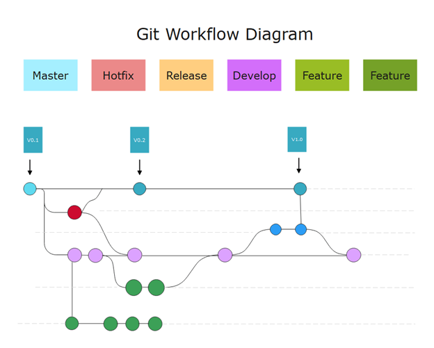

## **Git Flow: A Comprehensive Guide**  

Git Flow is a branching model for Git, introduced by **Vincent Driessen** in **2010**, that provides a structured approach to software development. It defines distinct branch types and merging strategies for managing features, releases, and hotfixes effectively.

---

## **Types of Branches in Git Flow**  

Git Flow consists of **five primary branch types**, each with a specific role:

### 1 **Main Branch (`main` or `master`)**  
- Stores **stable production code**.
- Every release is tagged here.
- No direct commits—only merges from `release` or `hotfix` branches.

### 2️ **Develop Branch (`develop`)**  
- Serves as the integration branch for features.
- New features are merged here.
- When stable, it is used to create a `release` branch.

### 3️ **Feature Branches (`feature/*`)**  
- Used for developing **new features**.
- Created from `develop` and merged back when complete.
- Naming Convention: `feature/<feature-name>`

### 4️ **Release Branches (`release/*`)**  
- Prepares for a new release (final bug fixes, documentation).
- Created from `develop`, merged into `main` and `develop` after release.
- Naming Convention: `release/<version-number>`

### 5️ **Hotfix Branches (`hotfix/*`)**  
- Fixes **critical production issues**.
- Created from `main`, merged into both `main` and `develop`.
- Naming Convention: `hotfix/<fix-name>`

---

## **Merge Strategies in Git Flow**  

| **Branch Type** | **Merged Into** | **Merge Type** |
|---------------|---------------|----------------|
| `feature/*` | `develop` | Squash / Merge Commit |
| `release/*` | `main`, `develop` | Merge Commit |
| `hotfix/*` | `main`, `develop` | Merge Commit |

- **Feature branches** use **squash merges** to keep history clean.  
- **Release and Hotfix branches** use **merge commits** to track version history.

---


---


---
## **Git Flow Commands with Tags**  

###  **Initialize Git Flow**
```sh
git flow init
```

###  **Feature Workflow**  
```sh
git flow feature start new-feature
# Work on the feature...
git flow feature finish new-feature
```

###  **Release Workflow**  
```sh
git flow release start 1.0.0
# Final bug fixes...
git flow release finish 1.0.0
```
**Tag the release**:  
```sh
git tag -a v1.0.0 -m "Release version 1.0.0"
git push origin --tags
```

###  **Hotfix Workflow**  
```sh
git flow hotfix start fix-critical-bug
# Apply fixes...
git flow hotfix finish fix-critical-bug
```

---


## **Summary of Git Flow**  

| **Aspect**  | **Details** |
|-------------|------------|
| **Introduced** | 2010 by Vincent Driessen |
| **Branching Model** | Main, Develop, Feature, Release, Hotfix |
| **Main Merge Strategies** | Squash (Feature), Merge Commit (Release, Hotfix) |
| **Version Control** | Tags used for release versions |
| **Best For** | Large teams & projects with structured release cycles |
| **Automation** | `git-flow` extension available |


